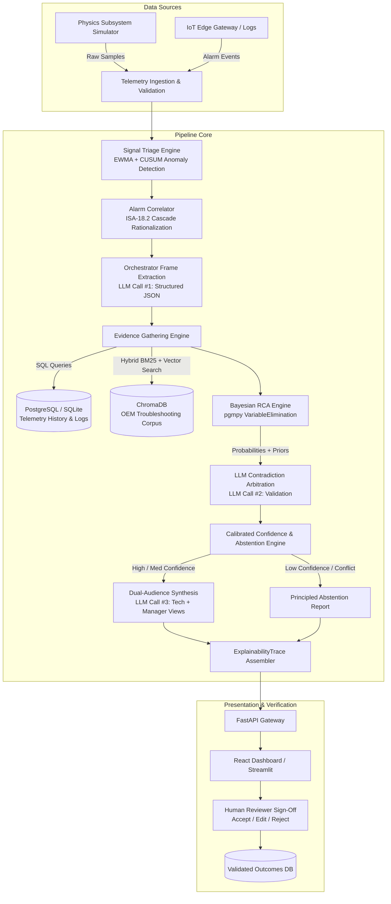

# ElevateRCA 🛗⚡
### Autonomous Fault Isolation & Evidence-Driven Root Cause Analysis Assistant for Modern Elevators

[](https://www.python.org/downloads/)
[](https://fastapi.tiangolo.com)
[](https://pgmpy.org)
[](https://www.trychroma.com)
[](#-safety--architectural-boundaries)
[](https://github.com/Starmann1/ElevateRCA.git)

---

## 📌 Executive Summary

**ElevateRCA** is a deterministic, evidence-driven diagnostic intelligence layer designed for modern gearless traction elevators (such as KONE MonoSpace® / MiniSpace® featuring EcoDisc® permanent magnet synchronous motors). 

ElevateRCA bridges the critical operational gap between **raw alarm detection** (industry standard Level 3–4 IoT monitoring) and **structured diagnostic intelligence** (Level 5–6 Root Cause Analysis). Rather than treating cascading alarms as independent incidents or relying on ungrounded black-box LLMs, ElevateRCA:
1. Clusters cascading alarm floods into a single coherent **Fault Episode** using ISA-18.2 alarm rationalization.
2. Evaluates **competing physical failure hypotheses** across 6 subsystem fault trees using exact Bayesian Network inference (`pgmpy`).
3. Actively tests and eliminates alternative hypotheses using negative evidence.
4. Generates an auditable **`ExplainabilityTrace`** linking every claim directly to raw telemetry, SQL logs, and retrieved OEM troubleshooting documentation.
5. Calibrates confidence mathematically and **refuses to guess (principled abstention)** when telemetry is ambiguous or insufficient.
6. Operates strictly as a **read-only advisory layer** completely decoupled from the physical safety-control loop.

```
┌────────────────────────────────────────────────────────────────────────┐
│                        ELEVATOR SAFETY CONTROL                         │
│       Hardware Safety Chain · PESSRAL · Brakes · Door Locks            │
└───────────────────────────────────┬────────────────────────────────────┘
                                    │ ONE-WAY READ-ONLY TELEMETRY
                                    ▼
┌────────────────────────────────────────────────────────────────────────┐
│                    ELEVATERCA DIAGNOSTIC LAYER                         │
│   Ingest → Triage (EWMA/CUSUM) → Correlate → Bayesian RCA → Explain   │
└───────────────────────────────────┬────────────────────────────────────┘
                                    │ ADVISORY OUTPUT (NO CONTROL)
                                    ▼
┌────────────────────────────────────────────────────────────────────────┐
│                           HUMAN TECHNICIAN                             │
│               Physical Inspection · Verification · Repair              │
└────────────────────────────────────────────────────────────────────────┘
```

---

## 🎯 What ElevateRCA IS vs. What It IS NOT

| What ElevateRCA **IS** | What ElevateRCA **IS NOT** |
| :--- | :--- |
| **Evidence-driven RCA layer** evaluating competing hypotheses | **Autonomous controller** manipulating motors or brakes |
| **Causal alarm correlator** distinguishing root cause from cascade | **Generic LLM chatbot** answering open-ended conversational prompts |
| **Mathematically grounded** Bayesian network + deterministic rules | **Black-box AI** calculating diagnostic probabilities inside an LLM |
| **Principled abstention engine** that safely says "insufficient data" | **Speculative predictive maintenance** claiming exact remaining life |
| **Strict read-only advisory layer** keeping humans firmly in the loop | **Direct safety-chain interface** or autonomous reset mechanism |

---

## 🚀 5 Defensible Core Differentiators

### 1. Causal Alarm Cascade Correlation
When an elevator experiences a disturbance (e.g., mechanical resistance on guide rails), it often triggers an alarm cascade: *Drive Overcurrent → Drive Safety Trip → Controller Safety Chain Interruption → Car Stopped Outside Landing*. ElevateRCA applies ISA-18.2 temporal clustering (15s sliding window) and topological causal graph traversal to collapse dozens of cascading alarms into one unified fault episode, pinpointing the originating trigger.

### 2. Multi-Hypothesis Bayesian Reasoning Space
A single symptom (such as *Motor Overcurrent*) can stem from 5+ fundamentally different root causes:
* Stator winding inter-turn short
* Inverter IGBT switch failure
* Mechanical binding / rope traction jam
* Motor brake drag / delayed drop
* Inverter V/f or vector control parameter mismatch

ElevateRCA builds and evaluates structured Bayesian Networks (`pgmpy` VariableElimination) over 6 elevator subsystem fault trees to compute $P(\text{Root Cause} \mid \text{Observed Evidence})$.

### 3. Active Alternative Elimination via Negative Evidence
ElevateRCA does not stop at confirming a top hypothesis—it explicitly proves why alternative hypotheses are ruled out. Crucially, it models **4 discrete states of negative evidence**:
* **True Negative:** Sensor measured normally (informative; active contradiction of a candidate cause).
* **Missing Data:** Telemetry dropped or unrecorded (zero diagnostic weight; does not rule out).
* **Unreliable / Degraded Sensor:** Sensor health flag degraded (discounted evidence).
* **Unobserved:** Sensor not equipped on this elevator configuration.

### 4. Auditable `ExplainabilityTrace` Artifact
Every diagnostic recommendation is backed by a structured, immutable `ExplainabilityTrace` JSON object. Every assertion cites:
* Raw sensor metrics (vibration RMS, phase current peaks, encoder pulse counts).
* Exact timestamped event logs.
* Retrieved excerpts from OEM engineering manuals via Hybrid BM25/Vector RAG (`ChromaDB`).

### 5. Calibrated Confidence & Principled Abstention
Confidence is divided into **Diagnostic Confidence** ($C_{diag}$) and **Action Confidence** ($C_{act}$). If telemetry is sparse, contradictory, or conflicting:
* **High Confidence ($C_{diag} \ge 0.85$):** Concrete diagnosis with specific corrective action.
* **Medium Confidence ($0.60 \le C_{diag} < 0.85$):** Probable diagnosis with targeted pre-repair verification steps.
* **Low / Ambiguous ($C_{diag} < 0.60$):** **Principled Abstention** — the system explicitly states it cannot isolate the fault with high certainty, outlines what evidence is missing, and routes to senior technician manual triage.

---

## 🛡️ Safety & Architectural Boundaries

In compliance with elevator safety standards (**EN 81-20/50**, **ASME A17.1**, **IEC 61508 SIL-3** and **PESSRAL**):

```
┌─────────────────────────────────────────────────────────────┐
│                   PERMITTED CAPABILITIES                    │
├─────────────────────────────────────────────────────────────┤
│  ✓ Ingest read-only sensor telemetry & fault logs           │
│  ✓ Detect statistical changepoints & anomalies              │
│  ✓ Correlate alarms into fault episodes                     │
│  ✓ Query engineering documentation via RAG                  │
│  ✓ Compute Bayesian posterior probabilities                 │
│  ✓ Recommend prioritized inspection checklists              │
│  ✓ Render tailored views for technicians & facility managers│
└─────────────────────────────────────────────────────────────┘

┌─────────────────────────────────────────────────────────────┐
│                 FORBIDDEN CAPABILITIES                      │
├─────────────────────────────────────────────────────────────┤
│  ✗ NO autonomous motor, drive, or brake manipulation        │
│  ✗ NO door open/close actuation or safety-edge override     │
│  ✗ NO safety chain bypass or reset                          │
│  ✗ NO autonomous passenger rescue attempts                  │
│  ✗ NO autonomous dispatch of physical work orders           │
│  ✗ NO direct writing to elevator controller memory          │
└─────────────────────────────────────────────────────────────┘
```

---

## 🏗️ End-to-End System Architecture

ElevateRCA utilizes a **single deterministic orchestrator pipeline** with scoped tool calling (avoiding brittle autonomous multi-agent swarm loops):



### Deterministic vs. LLM Boundary
* **Deterministic (No LLM):** Signal processing, CUSUM changepoint detection, alarm window clustering, SQL queries, vector indexing, Bayesian probability calculation, and safety boundary enforcement.
* **LLM Touchpoints (Strictly Scoped & JSON Schema Enforced):**
  1. **Call #1 (Orchestration):** Transforms correlated raw alarms and telemetry into a structured `InvestigationFrame`.
  2. **Call #2 (Arbitration):** Cross-checks Bayesian top hypotheses against non-network evidence to detect qualitative contradictions.
  3. **Call #3 (Synthesis):** Formats verified diagnostic findings into dual audience views: an actionable, technical checklist for the field engineer and an impact summary for the facility manager.

---

## 🔬 Subsystem Coverage & Physics Simulators

ElevateRCA models 5 key physical elevator subsystems:

```
kone-elevate-rca/simulator/
├── drive_motor.py         # PMSM EcoDisc motor, V3F drive, IGBT thermal, 3-phase currents
├── door.py                # Door operator motor, belt slip, skate rollers, photo-eye curtain
├── brake_traction.py      # Dual-plunger electromagnetic brake, switch timing, traction sheave
├── controller_safety.py   # Safety circuit contacts, governor, landing door locks, PESSRAL
└── sensor_env.py          # Hoistway vibrations, bearing acoustics, ambient temperature
```

### 6 Standard Subsystem Fault Trees Modeled:
1. **Drive & Inverter Subsystem:** IGBT short/open, DC link bus degradation, phase imbalance, thermal overload.
2. **PMSM Hoisting Motor:** Stator winding degradation, bearing race wear, demagnetization, rotor eccentricity.
3. **Landing & Car Door System:** Photo-eye sensor misalignment, skate roller wear, door belt slack, lock contact fouling.
4. **Brake & Traction Assembly:** Plunger mechanical sticking, microswitch contact bounce, lining wear, brake drag.
5. **Position & Velocity Feedback:** Optical incremental encoder pulse dropout, leveling vane misalignment, slip.
6. **Safety Chain Circuit:** Governor contact trip, landing door lock break, buffer switch trip, phase reversal relay.

---

## 🧪 5 Canonical Validation Scenarios

ElevateRCA is verified against 5 canonical failure scenarios demonstrating discrimination between confusing symptoms:

| Scenario | Symptom / Consequential Alarms | Competing Hypotheses | Negative / Distinguishing Evidence | Final Isolated Root Cause |
| :--- | :--- | :--- | :--- | :--- |
| **1. Motor Overcurrent** | Phase current surge, drive safety trip | • IGBT Switch Failure<br>• Stator Short<br>• Mechanical Jam | Inverter internal diagnostics pass; vibration sensor indicates 4.8g shock; no drive temp rise | **Mechanical Shaft Jam** |
| **2. Door Cycle Degradation** | Door close timeout, safety reopening cascade | • Photo-eye Sensor Drift<br>• Door Motor Failure<br>• Mechanical Obstruction | Door motor current normal; photo-eye beam interruption count erratic; reopen duration < 200ms | **Photo-Eye Sensor Drift** |
| **3. Brake Lag & Drag** | Starting delay, high starting torque, jerk | • Brake Microswitch Sticking<br>• Drive Torque Limit<br>• Brake Coil Failure | Brake pick current verified; microswitch transition delayed by 180ms; holding torque nominal | **Brake Microswitch Lag** |
| **4. Leveling Error** | Car stopping 25mm above landing sill | • Encoder Pulse Dropout<br>• Rope Traction Slip<br>• Floor Vane Misalignment | Floor vane sensor signal sharp; tachometer vs encoder divergence observed during deceleration | **Encoder Feedback Dropout** |
| **5. Ambiguous Evidence** | Intermittent safety chain flutter (50ms) | • Pit Switch Contact Bounce<br>• Traveling Cable Wear<br>• Relay Oxidation | Event duration shorter than telemetry sampling frequency; zero sensor corroboration | **Principled Abstention** *(Refuses guess; recommends high-speed logging)* |

---

## 📁 Repository Structure

```
ElevateRCA/
├── api/                           # FastAPI Backend Service
│   ├── main.py                    # API entrypoint, CORS & middleware
│   ├── deps.py                    # Dependency injection (DB, RAG, config)
│   ├── schemas.py                 # Pydantic v2 data contracts
│   └── routes/                    # API endpoints
│       ├── telemetry.py           # Telemetry ingestion endpoints
│       ├── episodes.py            # Fault episode management
│       ├── diagnosis.py           # Diagnostic execution & human review
│       ├── explainability.py      # ExplainabilityTrace query endpoints
│       └── demo.py                # Scenario fault-injection runner
├── pipeline/                      # Core RCA Reasoning Engine
│   ├── pipeline.py                # Pipeline master coordinator
│   ├── triage.py                  # EWMA baseline tracking & CUSUM anomaly detector
│   ├── correlation.py             # ISA-18.2 temporal clustering & causal linking
│   ├── orchestrator.py            # LLM Call #1: Investigation frame extraction
│   ├── retrieval.py               # Deterministic SQL + ChromaDB hybrid RAG
│   ├── rca.py                     # pgmpy Bayesian Network inference + arbitration
│   ├── synthesis.py               # Lookup + LLM Call #3: Dual audience rendering
│   └── explainability.py          # Immutable ExplainabilityTrace assembler
├── simulator/                     # Physics-Grounded Subsystem Simulators
│   ├── base.py                    # SubsystemSimulator Protocol
│   ├── elevator.py                # Composite Elevator physics simulator
│   ├── drive_motor.py             # PMSM & V3F drive physics
│   ├── door.py                    # Elevator door kinematics & photo-eye model
│   ├── brake_traction.py          # Brake plunger dynamics & traction model
│   ├── controller_safety.py       # Safety loop contact series & state machine
│   ├── sensor_env.py              # Hoistway vibration, acoustics & ambient model
│   ├── alarm_generator.py         # Threshold & cascade alarm generator
│   ├── faults.py                  # 10 synthetic fault-injection functions
│   └── scenario.py                # 5 end-to-end scenario orchestrators
├── knowledge/                     # Structured Domain Knowledge (Deterministic)
│   ├── failure_modes.yaml         # 6 Subsystem fault trees, FMEA & conditional priors
│   ├── causal_links.yaml          # Alarm cascade propagation graphs
│   └── corrective_actions.yaml    # Approved OEM maintenance action catalog
├── rag_corpus/                    # Curated Engineering Troubleshooting Corpus
│   ├── fault_code_glossary.md     # KONE/Standard elevator fault code index
│   ├── drive_motor_troubleshooting.md
│   ├── door_troubleshooting.md
│   ├── brake_troubleshooting.md
│   └── encoder_troubleshooting.md
├── dashboard/                     # Web UI for Technicians & Facility Managers
│   ├── src/                       # React + TypeScript frontend
│   │   ├── components/            # Fleet overview, live telemetry, trace viewer
│   │   └── App.tsx
│   └── streamlit_app.py           # Lightweight interactive Python UI fallback
├── db/                            # Database Layer
│   ├── models.py                  # SQLAlchemy ORM models
│   ├── session.py                 # Engine & session management
│   └── crud.py                    # Database operations
├── docs/                          # Architecture & Research Documentation (16 phases)
│   ├── KONE_Elevate_Technical_Architecture_Guidebook.md
│   ├── KONE_Elevate_Phase12_Final_Synthesis_Master_Reference.md
│   └── implementation/            # 30-hour hackathon execution blueprints
├── tests/                         # Pytest Verification Suite
│   ├── test_simulator.py          # Subsystem physics tests
│   ├── test_triage.py             # EWMA/CUSUM anomaly detection tests
│   ├── test_correlation.py        # Alarm clustering & cascade tests
│   ├── test_rca.py                # Bayesian network inference tests
│   ├── test_confidence.py         # Abstention boundary tests
│   ├── test_pipeline.py           # End-to-end diagnosis tests
│   └── test_scenarios.py          # 5 validation scenarios tests
├── docker-compose.yml             # Container orchestration (API, DB, UI)
├── Dockerfile                     # Multi-stage container build
├── pyproject.toml                 # Package configuration & dependencies
└── requirements.txt               # Locked Python dependencies
```

---

## ⚡ Quickstart & Installation

### 1. Prerequisites
* **Python 3.12+**
* **Node.js 18+** *(if running React UI)* or **Streamlit** *(for Python UI)*
* **Docker & Docker Compose** *(optional, for containerized run)*
* API Key: `ANTHROPIC_API_KEY` or `GEMINI_API_KEY` (for structured LLM calls)

### 2. Clone & Environment Setup
```bash
# Clone the repository
git clone https://github.com/Starmann1/ElevateRCA.git
cd ElevateRCA

# Create and activate virtual environment
python -m venv .venv
# On Windows:
.venv\Scripts\activate
# On Linux/macOS:
source .venv/bin/activate

# Install dependencies
pip install -r requirements.txt
```

### 3. Environment Configuration
Create a `.env` file in the root directory:
```ini
ENVIRONMENT=development
DATABASE_URL=sqlite:///./elevaterca.db
CHROMA_PERSIST_DIRECTORY=./chroma_data
LLM_PROVIDER=anthropic   # or gemini / mock for offline testing
ANTHROPIC_API_KEY=your_api_key_here
```

### 4. Run the Physics Simulator & Fault Scenarios
Run any of the 5 canonical scenarios directly via CLI:
```bash
# Run Scenario 1: Drive Overcurrent vs Mechanical Jam
python -m simulator.scenario --scenario 1

# Run Scenario 5: Ambiguous Evidence (Testing Principled Abstention)
python -m simulator.scenario --scenario 5
```

### 5. Launch the ElevateRCA Backend
```bash
# Start FastAPI backend with automatic hot-reload
uvicorn api.main:app --host 0.0.0.0 --port 8000 --reload
```
Swagger UI will be accessible at: `http://localhost:8000/docs`

### 6. Launch the Dashboard
#### Option A: Streamlit UI (Fastest)
```bash
streamlit run dashboard/streamlit_app.py
```
#### Option B: React Dashboard
```bash
cd dashboard
npm install
npm run dev
```

---

## 📡 API Overview

| Method | Endpoint | Description |
| :--- | :--- | :--- |
| `POST` | `/api/v1/telemetry` | Ingest streaming elevator sensor telemetry packets |
| `POST` | `/api/v1/events` | Ingest discrete state transitions and alarm events |
| `GET` | `/api/v1/episodes` | List correlated fault episodes with severity ratings |
| `POST` | `/api/v1/demo/inject-fault` | Trigger synthetic fault scenarios (Scenarios 1–5) |
| `POST` | `/api/v1/diagnosis/run/{episode_id}` | Trigger end-to-end RCA diagnostic pipeline |
| `GET` | `/api/v1/diagnosis/{id}` | Retrieve ranked hypotheses and dual-audience view |
| `GET` | `/api/v1/explainability/{id}` | Export full immutable `ExplainabilityTrace` JSON |
| `POST` | `/api/v1/diagnosis/{id}/review` | Submit technician human sign-off (*Accept / Edit / Reject*) |

---

## 🔍 The `ExplainabilityTrace` Artifact

Below is an abbreviated example of an `ExplainabilityTrace` generated for **Scenario 1**:

```json
{
  "trace_id": "trc_20260923_00192",
  "elevator_id": "ELEV-DX-04",
  "episode_id": "ep_98214",
  "timestamp": "2026-09-23T22:45:12Z",
  "correlated_alarms": [
    { "code": "E101", "name": "Drive Overcurrent", "type": "primary", "timestamp_offset_ms": 0 },
    { "code": "E302", "name": "Drive Safety Trip", "type": "consequential", "timestamp_offset_ms": 320 },
    { "code": "E040", "name": "Safety Chain Open", "type": "consequential", "timestamp_offset_ms": 480 }
  ],
  "hypotheses_evaluated": [
    {
      "rank": 1,
      "cause": "Mechanical Hoistway / Car Jam",
      "posterior_probability": 0.884,
      "supporting_evidence": [
        "Vibration sensor Z-axis peak: 4.82g (> 3.5σ changepoint)",
        "Motor current spiked to 210% of rated nominal within 80ms of travel",
        "Drive IGBT thermal sensors registered nominal 42°C (rules out electrical short)"
      ],
      "contradicting_evidence": []
    },
    {
      "rank": 2,
      "cause": "IGBT Inverter Switch Failure",
      "posterior_probability": 0.072,
      "supporting_evidence": ["Motor overcurrent trip event"],
      "contradicting_evidence": [
        "Inverter internal diagnostic self-test passed",
        "IGBT junction temperatures normal (42°C vs >110°C expected)"
      ],
      "elimination_status": "ELIMINATED"
    }
  ],
  "confidence_assessment": {
    "diagnostic_confidence": 0.88,
    "confidence_tier": "HIGH",
    "abstention_triggered": false
  },
  "action_recommendation": {
    "technician_view": {
      "priority_action": "Inspect car guide shoes and hoistway counterweight rails for mechanical binding at Floor 4-5.",
      "safety_warning": "Engage machine room lock-out/tag-out (LOTO) and verify brake drop before entering hoistway.",
      "citations": ["KONE MiniSpace Maintenance Manual Section 4.2: Guide Shoe Clearance"]
    },
    "building_manager_view": {
      "status_summary": "Elevator stopped automatically due to mechanical resistance detected in the hoistway.",
      "estimated_scope": "Mechanical inspection required. Estimated investigation duration: 45 minutes."
    }
  },
  "human_review": {
    "status": "PENDING_VERIFICATION",
    "verified_by": null,
    "review_action": null
  }
}
```

---

## 🧪 Testing & Verification Suite

ElevateRCA includes an extensive automated test suite covering unit physics, algorithms, boundary conditions, and full scenarios:

```bash
# Run all automated tests
pytest tests/ -v

# Run Bayesian RCA reasoning tests
pytest tests/test_rca.py -v

# Run Principled Abstention boundary verification
pytest tests/test_confidence.py -v

# Run End-to-End Demo Scenario validation
pytest tests/test_scenarios.py -v
```

---

## 👥 Team & Provenance

* **Project:** KONE Elevate — Autonomous Fault Isolation & Root Cause Analysis (ElevateRCA)
* **Team:** **Team NexGen** (formerly RiskForge)
* **Lead / Developer:** **Arul Amudhan G**
* **Institution:** Rajalakshmi Engineering College
* **Competition:** KONE Elevate 2026 Hackathon
* **Repository:** [https://github.com/Starmann1/ElevateRCA.git](https://github.com/Starmann1/ElevateRCA.git)

---

## 📜 Intellectual Property & Disclaimer
ElevateRCA is an independent academic research and hackathon proposal created for the KONE Elevate competition. All trademarked names (KONE, MonoSpace, MiniSpace, EcoDisc) belong to KONE Corporation. ElevateRCA operates solely as an advisory, simulated diagnostic layer and contains no proprietary OEM source code.
