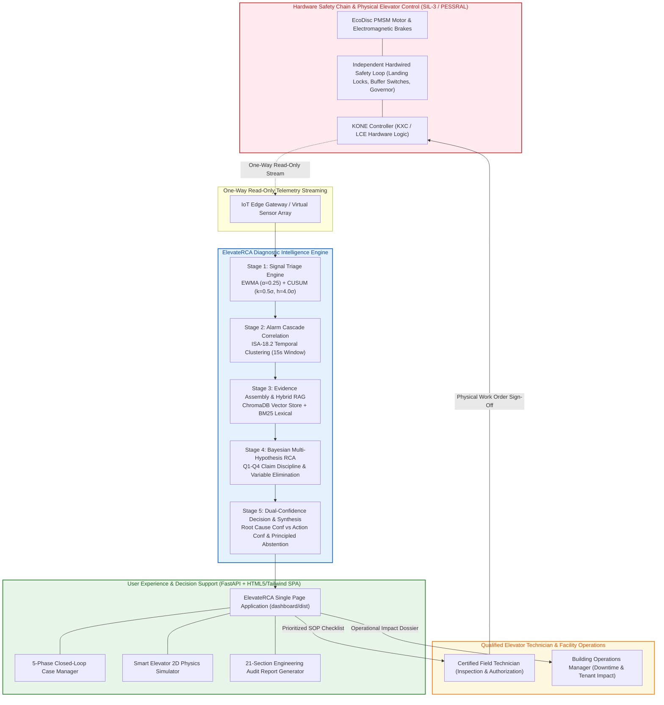
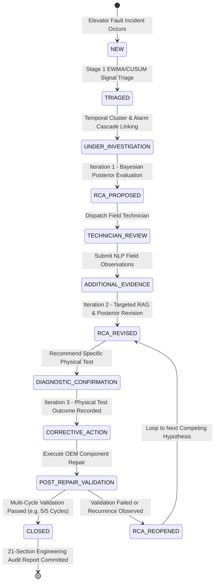
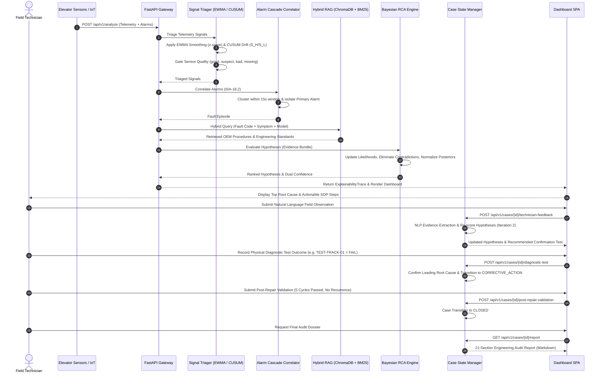

# ElevateRCA 🛗⚡
### Autonomous Fault Isolation, Bayesian RCA & Closed-Loop Work Order Management for Modern Elevators

[](https://www.python.org/downloads/)
[](https://fastapi.tiangolo.com)
[](https://tailwindcss.com)
[](#-stage-4-bayesian-reasoning--multi-hypothesis-rca)
[](#-stage-1-signal-triage--statistical-anomaly-detection)
[](https://www.trychroma.com)
[](#-automated-testing--verification-suite)
[](#-safety--architectural-boundaries)
[](https://github.com/Starmann1/ElevateRCA.git)

---

## 📌 Executive Summary

**ElevateRCA** is a deterministic, evidence-grounded diagnostic intelligence system engineered for modern gearless traction elevators (such as KONE MonoSpace® / MiniSpace® powered by EcoDisc® permanent magnet synchronous motors).

ElevateRCA bridges the critical operational gap between **raw alarm detection** (Level 3–4 IoT telemetry monitoring) and **structured diagnostic intelligence** (Level 5–6 Root Cause Analysis). Rather than treating cascading alarms as independent trips or relying on ungrounded black-box LLMs, ElevateRCA:

1. **Statistical Changepoints & Drift Detection**: Employs **Exponentially Weighted Moving Average (EWMA)** smoothing and **Two-Sided Tabular Cumulative Sum (CUSUM)** control charts to detect subtle mechanical, thermal, and electrical drifts before catastrophic trip thresholds are reached.
2. **Causal Alarm Cascade Rationalization**: Collapses cascading alarm floods into a single coherent **Fault Episode** using **ISA-18.2** temporal clustering and topological dependency traversal.
3. **Multi-Hypothesis Bayesian Reasoning**: Evaluates competing physical failure hypotheses across 6 subsystem fault trees using exact Bayesian updating:
   $$\sum_{i=1}^{n} P(H_i \mid E) = 1.0$$
4. **Active Alternative Elimination via Negative Evidence**: Evaluates **4 discrete states of negative evidence** (*True Negative, Missing, Degraded Sensor, Unobserved*) to eliminate candidate causes with mathematical proof.
5. **Closed-Loop Diagnostic State Machine**: Implements a 5-phase deterministic state machine with technician-in-the-loop observation NLP ingestion, targeted physical confirmation tests, post-repair multi-cycle validation, and full **21-section engineering audit report** generation.
6. **Principled Abstention**: Calibrates root cause and action confidence separately, safely refusing to speculate when telemetry is degraded or evidence is tied.
7. **Decoupled Safety Boundary**: Operates strictly as a **read-only advisory layer** completely isolated from the SIL-3 / PESSRAL physical safety chain.

---

## 🎯 What ElevateRCA IS vs. What It IS NOT

| Feature | What ElevateRCA **IS** | What ElevateRCA **IS NOT** |
| :--- | :--- | :--- |
| **Control Safety** | **Strict Read-Only Advisory Layer** with human-in-the-loop | **Autonomous Controller** manipulating motors, drives, or brakes |
| **Reasoning Model** | **Evidence-Driven Bayesian RCA** over structured fault trees | **Ungrounded Black-Box LLM** guessing root causes from prompts |
| **Anomaly Detection** | **EWMA (\(\alpha=0.25\)) + Two-Sided CUSUM (\(k=0.5\sigma, h=4.0\sigma\))** | **Static Threshold Flagging** that triggers false alarm storms |
| **Alarm Handling** | **ISA-18.2 Cascade Correlation** grouping consequential trips | **Isolated Alarm Ticker** treating every consequential trip as unique |
| **Field Interaction** | **Closed-Loop State Machine** guiding step-by-step verification | **Static Ticket Dispatcher** with zero post-repair verification |
| **Uncertainty** | **Principled Abstention** (refuses to guess on degraded data) | **Forced Decision Engine** that guesses despite missing sensors |
| **Frontend UI** | **High-Performance HTML5 / Tailwind SPA** + 2D Physics Simulator | **Generic Dashboard** without physical context or kinematics |

---

## 🛡️ Safety & Architectural Boundaries

In strict compliance with international elevator safety standards (**EN 81-20/50**, **ASME A17.1-2013**, **IEC 61508 SIL-3**, and **PESSRAL**), ElevateRCA enforces an uncompromising one-way isolation boundary:



```
┌─────────────────────────────────────────────────────────────┐
│                   PERMITTED CAPABILITIES                    │
├─────────────────────────────────────────────────────────────┤
│  ✓ Ingest read-only sensor telemetry & fault logs           │
│  ✓ Detect statistical changepoints & parameter drifts       │
│  ✓ Correlate alarms into unified fault episodes             │
│  ✓ Query OEM engineering documentation via Hybrid RAG       │
│  ✓ Compute Bayesian posterior probabilities                 │
│  ✓ Recommend prioritized inspection checklists              │
│  ✓ Render tailored views for technicians & facility managers│
│  ✓ Manage closed-loop diagnostic state machine iterations   │
│  ✓ Generate immutable 21-section engineering audit reports  │
└─────────────────────────────────────────────────────────────┘

┌─────────────────────────────────────────────────────────────┐
│                 FORBIDDEN CAPABILITIES                      │
├─────────────────────────────────────────────────────────────┤
│  ✗ NO autonomous motor, drive, or brake manipulation        │
│  ✗ NO door open/close actuation or safety-edge override     │
│  ✗ NO safety chain bypass, reset, or bridge installation    │
│  ✗ NO autonomous passenger rescue attempts                  │
│  ✗ NO direct writing to elevator controller memory or registers│
│  ✗ NO clearing of active fault codes without human sign-off │
└─────────────────────────────────────────────────────────────┘
```

---

## ⚙️ 5-Stage Diagnostic Pipeline Architecture

```mermaid
flowchart LR
    subgraph S1["Stage 1: Triage"]
        IN1["Telemetry Ingestion"] --> EWMA["EWMA Smoothing<br/>(α = 0.25)"]
        EWMA --> CUSUM["Two-Sided CUSUM<br/>(S_H, S_L Drift)"]
        CUSUM --> GATE["Sensor Quality Gating<br/>(Exclude bad/missing)"]
    end

    subgraph S2["Stage 2: Correlate"]
        GATE --> CLUST["ISA-18.2 Window<br/>(15s Sliding Cluster)"]
        CLUST --> PRIM["Identify Primary Alarm"]
        PRIM --> TOPO["Topological Cascade Graph"]
    end

    subgraph S3["Stage 3: Evidence"]
        TOPO --> EVID["Assemble 6 Channels"]
        EVID --> RAG["Hybrid RAG Search<br/>(ChromaDB + BM25)"]
        RAG --> BUNDLE["Evidence Bundle<br/>(Provenances Tagged)"]
    end

    subgraph S4["Stage 4: Bayesian RCA"]
        BUNDLE --> PRIORS["Assign FMEA Priors"]
        PRIORS --> LIKELIHOOD["Likelihood Multipliers<br/>(Telemetry + Alarms)"]
        LIKELIHOOD --> ELIM["True Negative Rule-Out<br/>(Zero Prob Clamping)"]
        ELIM --> POST["Normalize Posterior Probabilities"]
    end

    subgraph S5["Stage 5: Synthesis"]
        POST --> DUAL["Dual Confidence Scoring<br/>(C_diag & C_act)"]
        DUAL --> CHECK{"Ambiguous or Degraded?"}
        CHECK -- Yes --> ABSTAIN["Principled Abstention<br/>(Refuse Speculative Guess)"]
        CHECK -- No --> DISPATCH["Generate SOP & Trace<br/>(Tech Checklist + Manager View)"]
    end
```



---

## 📈 Stage 1: Signal Triage & Statistical Anomaly Detection

To isolate incipient elevator mechanical and electrical issues before safety-chain trips occur, ElevateRCA implements real-time **EWMA** and **Two-Sided Tabular CUSUM** trackers in [`pipeline/triage.py`](file:///d:/HACKATHONS/KONE%20Elevate/prototype/ElevateRCA/pipeline/triage.py):

### 1. Exponentially Weighted Moving Average (EWMA)
Smooths high-frequency sensor noise while responding rapidly to sustained step-shifts:
$$\bar{x}_t = \alpha \cdot x_t + (1 - \alpha) \cdot \bar{x}_{t-1}$$
$$\sigma_t^2 = (1 - \alpha) \cdot \left[ \sigma_{t-1}^2 + \alpha \cdot (x_t - \bar{x}_{t-1})^2 \right]$$
$$z_t = \frac{|x_t - \bar{x}_{t-1}|}{\sigma_{process}}$$

* Parameter: Smoothing factor $\alpha = 0.25$.
* Normalized $z$-score evaluates deviation against OEM engineering process standards.

### 2. Two-Sided Tabular CUSUM Control Chart
Detects small, persistent parameter drifts (e.g. accumulation of grit in door sill grooves, brake lining wear, gradual motor thermal degradation):
$$S_H(t) = \max\left(0, S_H(t-1) + \frac{x_t - \mu_0}{\sigma} - k\right)$$
$$S_L(t) = \max\left(0, S_L(t-1) - \frac{x_t - \mu_0}{\sigma} - k\right)$$

* Allowance parameter: $k = 0.5\sigma$ (detects shifts of magnitude $1.0\sigma$).
* Decision threshold: $h = 4.0\sigma$ (out-of-control threshold triggering drift alarm).
* Out-of-control condition: If $S_H(t) > h$ or $S_L(t) > h$, drift is flagged.

### 3. Sensor Quality Gating & State Awareness
* **Quality Gating**: If sensor status is `"bad"` or `"missing"`, diagnostic weight is clamped to `0.0` (`diagnostic_value = NONE`). It cannot be used to confirm or eliminate any hypothesis.
* **Operating State Context**: Norm checks are conditioned on the elevator operating mode (e.g. door motor current is expected to be 0A during leveling travel, 1.5–2.5A during door closing).

---

## 🧠 Stage 4: Bayesian Reasoning & Multi-Hypothesis RCA

A single symptom (such as *Motor Overcurrent E101*) can stem from multiple competing physical failure modes:

```mermaid
graph TD
    SYMPTOM["Observed Symptom: Drive Motor Overcurrent Trip (E101)"]
    
    H1["H1: Inverter IGBT Switch Failure<br/>Prior: 25% | Posterior: 98%"]
    H2["H2: Stator Winding Inter-Turn Short<br/>Prior: 20% | Posterior: 1%"]
    H3["H3: Mechanical Hoistway Guide Jam<br/>Prior: 20% | Posterior: 0% (RULED OUT)"]
    H4["H4: Mechanical Brake Drag / Delayed Pick<br/>Prior: 15% | Posterior: 1%"]
    H5["H5: V3F Inverter Parameter Mismatch<br/>Prior: 20% | Posterior: 0%"]

    SYMPTOM --> H1
    SYMPTOM --> H2
    SYMPTOM --> H3
    SYMPTOM --> H4
    SYMPTOM --> H5

    E1["(+) High IGBT Junction Temp (+55°C)"] -->|Likelihood x4.0| H1
    E2["(+) Rapid Current Rise (di/dt > 120A/ms)"] -->|Likelihood x3.5| H1
    
    E3["(-) Phase Resistance Imbalance < 0.05Ω"] -->|Likelihood x0.1| H2
    E4["(-) Zero Car Vibration Shock (0.08g Nominal)"] -->|Likelihood x0.01 (Contradiction)| H3
    E5["(-) Brake Coil Current Pick Fast (120ms)"] -->|Likelihood x0.1| H4
```

### Q1–Q4 Claim Discipline & Evidence Aggregation
1. **Prior Odds Formulation**: Historical failure rates and repeat repair history ($FMEA$) establish base prior weights:
   $$P(H_i)$$
   * If a previous repair failed or repeat symptom occurred within 30 days, prior probability is multiplied by $1.4\times$.
2. **Likelihood Multiplier Computation**: Evaluated across 6 independent evidence channels:
   $$L(E \mid H_i) = \prod_{k=1}^{m} \lambda_k(e_k \mid H_i)$$
3. **True Negative Elimination**: If physical contradiction evidence is observed (e.g. roller bearing rotates freely with zero play), the hypothesis likelihood is clamped to $\le 0.01$, ruling it out.
4. **Normalized Posterior Probability**:
   $$P(H_i \mid E) = \frac{P(H_i) \cdot L(E \mid H_i)}{\sum_{j=1}^{n} P(H_j) \cdot L(E \mid H_j)}$$

---

## 🔄 5-Phase Closed-Loop Case Management

ElevateRCA implements an interactive, multi-iteration diagnostic state machine in [`pipeline/state.py`](file:///d:/HACKATHONS/KONE%20Elevate/prototype/ElevateRCA/pipeline/state.py) and [`api/routes/cases.py`](file:///d:/HACKATHONS/KONE%20Elevate/prototype/ElevateRCA/api/routes/cases.py):



### End-to-End Diagnostic Sequence



---

## 💻 Modern UI Architecture

The frontend is a zero-latency Single Page Application (SPA) located at [`dashboard/dist/index.html`](file:///d:/HACKATHONS/KONE%20Elevate/prototype/ElevateRCA/dashboard/dist/index.html), styled with Tailwind CSS and Lucide icons, served directly from FastAPI:

1. **Diagnostic Workspace View**:
   - **Real-Time KPI Metric Cards**: Asset ID, Primary Root Trigger, Probable Root Cause Winner, Corrective SOP.
   - **EWMA & CUSUM Anomaly Tracking Strip**: Real-time display of max $z$-score, CUSUM drift status ($S_H/S_L$), and signal quality gating across all telemetry channels.
   - **Subsystem Fault Tree & Bayesian Ranking**: Live probability bars, active candidates vs. eliminated hypotheses, and supporting/contradicting evidence badges.
   - **RCA Synthesis & Dual Confidence**: Separate Root Cause Confidence ($C_{diag}$) and Action Confidence ($C_{act}$).
   - **Technician SOP Checklist**: Checkable OEM inspection steps, prohibited actions ("DO NOT DO"), and single-stage vs. two-stage Return-to-Service (RTS) simulator.
   - **Facility Operations & Investigation Dossier**: Markdown report viewer and building manager downtime forecasts.
2. **Smart Elevator Live Simulation View** ([`dashboard/dist/elevator_sim.js`](file:///d:/HACKATHONS/KONE%20Elevate/prototype/ElevateRCA/dashboard/dist/elevator_sim.js)):
   - **2D Hoistway Shaft Visualizer**: Interactive 5-floor hoistway (Ground, 1F, 2F, 3F, 4F), rotating EcoDisc PMSM sheave, counterweight kinematics, and dual-sliding doors.
   - **Virtual Optical Sensor Array**: Continuous beam-break detection for floor alignment and leveling accuracy.
   - **10 Synthetic Live Telemetry Cards**: Real-time door position, door speed, motor current, opening/closing times, vibration RMS, photo-eye status, reopen count, motor temp, and cycle count.
   - **Fault Replay Engine**: Live visual animation of door jams, optical sensor drift, rail friction, and emergency stop scenarios.
3. **Closed-Loop Case Management Modal**:
   - 5-phase interactive stepper with 1-click canonical demonstration case (`ELEV-DX-04`).
   - NLP field observation input, confirmation test recorder, post-repair validation submitter, and embedded 21-section report viewer.

---

## 📁 Repository Structure

```
ElevateRCA/
├── api/                           # FastAPI Backend Service
│   ├── __init__.py
│   ├── main.py                    # Application entrypoint & static SPA router
│   └── routes/
│       ├── __init__.py
│       └── cases.py               # 6 Closed-loop Case State Machine endpoints
├── dashboard/                     # Modern Frontend Application
│   └── dist/
│       ├── index.html             # High-performance Tailwind SPA
│       └── elevator_sim.js        # 2D Elevator Physics & Sensor Simulation Engine
├── pipeline/                      # Core Bayesian & Anomaly Engine
│   ├── __init__.py                # Unified package exports
│   ├── bayesian_rca.py            # Bayesian RCA Engine with Q1-Q4 discipline
│   ├── correlation.py             # ISA-18.2 15s alarm cascade correlation
│   ├── engine.py                  # ElevateRCA 5-Stage Orchestrator
│   ├── evidence.py                # 6-Channel Evidence Bundle Assembler
│   ├── guardrails.py              # SIL-3 Read-Only Safety Boundary & Forbidden Phrases
│   ├── models.py                  # Pydantic core domain models & data contracts
│   ├── rca.py                     # Closed-loop Bayesian hypothesis evaluator
│   ├── report.py                  # 21-Section Engineering Audit Report Generator
│   ├── schemas.py                 # TelemetryInput, ExplainabilityTrace, EvidenceItem
│   ├── state.py                   # CaseStateManager (5-Phase closed-loop lifecycle)
│   ├── synthesis.py               # Dual-confidence decision & principled abstention
│   ├── technician.py              # Natural language observation NLP interpreter
│   ├── triage.py                  # EWMATracker & CUSUMTracker statistical triage
│   ├── rag/                       # Offline GUIDE RAG Knowledge System
│   │   ├── classifier.py          # Document type & authority tier classifier
│   │   ├── parser.py              # PDF & CSV technical troubleshooting parser
│   │   ├── retriever.py           # Hybrid BM25 / vector evidence retriever
│   │   └── store.py               # ChromaDB vector knowledge store
│   ├── rag_ingest.py              # GUIDE corpus ingester
│   ├── rag_retrieval.py           # HybridRetriever implementation
│   ├── rag_schemas.py             # Document registry & chunk schemas
│   └── rag_store.py               # RAGVectorStore interface
├── simulator/                     # Elevator Physics & Scenario Simulators
│   ├── __init__.py
│   └── scenarios.py               # 6 Canonical Scenario Factories (Scenarios 1-6)
├── knowledge/                     # Structured Engineering Knowledge
│   ├── alarm_reference.yaml       # KONE alarm codes & severity ratings
│   ├── causal_links.yaml          # Alarm cascade causal propagation graphs
│   ├── corrective_actions.yaml    # Approved OEM maintenance actions
│   ├── failure_modes.yaml         # Subsystem fault trees, FMEA priors & rules
│   ├── kone_error_matrix.yaml     # 2D Error Table Matrix (Ranks F1-F7, Cols 1-8)
│   └── oem_guides.yaml            # Quantitative standards & ELV-001 to ELV-015
├── sample_telemetry/              # 20 Door Problem Telemetry Datasets
│   ├── TELEMETRY_CATALOG.json     # Catalog of all 20 door problem telemetries
│   └── telemetry_*.json           # Synthesized multi-signal elevator fault runs
├── GUIDE/                         # OEM Technical Documentation (15 Documents)
│   ├── elevator_troubleshooting_dataset.csv
│   ├── elevator_troubleshooting_dataset.json
│   ├── kone guide maintainance procdure.pdf
│   ├── sets-11.pdf
│   └── sets_egov_*.pdf
├── docs/                          # Comprehensive System Documentation
│   ├── API.md                     # REST API specification
│   ├── ARCHITECTURE.md            # System architecture details
│   ├── CLOSED_LOOP_DIAGNOSTICS.md # 5-Phase State Machine specification
│   ├── DEMO_SCENARIO.md           # Master demo walk-through guide
│   └── RCA_REASONING.md           # Mathematical Bayesian RCA formulation
├── tests/                         # Pytest Verification Suite (38 Tests)
│   ├── conftest.py                # Test fixtures & test paths
│   ├── test_50_telemetries.py     # 20 Door Telemetries automated test
│   ├── test_api.py                # API healthcheck & case lifecycle E2E
│   ├── test_claim_discipline.py   # Safety boundaries & forbidden phrases
│   ├── test_e2e_demo.py           # Master 5-iteration canonical E2E test
│   ├── test_ewma_cusum.py         # 11 EWMA & CUSUM statistical unit tests
│   ├── test_models.py             # Pydantic data models & state transition tests
│   ├── test_rag.py                # GUIDE classification & retrieval tests
│   ├── test_scenarios.py          # 6 Canonical scenarios test suite
│   ├── test_state.py              # Closed-loop case state machine tests
│   └── test_technician.py         # Technician NLP evidence extraction tests
├── pyproject.toml                 # Project metadata & pytest configuration
└── requirements.txt               # Locked dependencies
```

---

## 📡 REST API Reference

The FastAPI service exposes comprehensive diagnostic and case management endpoints:

| Method | Endpoint | Description | Request / Query |
| :--- | :--- | :--- | :--- |
| `GET` | `/` | Serves the interactive Single Page Application | None |
| `GET` | `/health` | ElevateRCA service health & safety boundary status | None |
| `GET` | `/api/v1/health` | Engine status, anomaly detectors, and RAG stats | None |
| `POST` | `/api/v1/analyze` | Executes 5-Stage RCA Pipeline for any input payload | `KONEFaultInput` JSON |
| `GET` | `/api/v1/incidents` | Lists active elevator fault incidents in fleet | None |
| `GET` | `/api/v1/incidents/{id}/payload` | Retrieves raw software output payload for incident | `incident_id` |
| `POST` | `/api/v1/incidents/{id}/analyze` | Runs 5-Stage RCA Pipeline on active incident | `incident_id` |
| `POST` | `/api/v1/cases` | Creates new closed-loop diagnostic case (Iteration 1) | `CreateCaseRequest` |
| `GET` | `/api/v1/cases/{case_id}` | Retrieves current case state, iteration, and hypotheses | `case_id` |
| `POST` | `/api/v1/cases/{case_id}/technician-feedback` | Ingests natural language technician field observation | `{"feedback_text": "..."}` |
| `POST` | `/api/v1/cases/{case_id}/diagnostic-test` | Records confirmation test result (`PASS`/`FAIL`) | `DiagnosticTestResultRequest` |
| `POST` | `/api/v1/cases/{case_id}/post-repair-validation` | Submits post-repair multi-cycle validation check | `PostRepairValidationRequest` |
| `GET` | `/api/v1/cases/{case_id}/report` | Generates official 21-section engineering audit report | `case_id` |
| `GET` | `/api/v1/telemetry-samples` | Lists synthetic fault samples (filter by subsystem) | `?subsystem=door` |
| `GET` | `/api/v1/telemetry-samples/{filename}` | Fetches raw JSON telemetry for specific sample | `filename` |
| `GET` | `/api/v1/error-matrix` | Returns 2D Error Table Matrix (Ranks F1-F7, Cols 1-8) | None |
| `GET` | `/api/v1/error-matrix/{code}` | Fetches details for specific error code (e.g. `F14`) | `code` |
| `GET` | `/api/v1/oem-guides` | Returns quantitative engineering standards | None |
| `POST` | `/api/v1/human-review` | Logs human review decision (`ACCEPTED`/`EDITED`/`REJECTED`) | `HumanReviewSubmission` |
| `GET` | `/api/v1/audit-log` | Retrieves immutable human sign-off audit trail | None |

---

## 📑 21-Section Engineering Audit Report

When a case is resolved, ElevateRCA's [`pipeline/report.py`](file:///d:/HACKATHONS/KONE%20Elevate/prototype/ElevateRCA/pipeline/report.py) compiles an exhaustive, immutable 21-section engineering audit report:

```
================================================================================
                    ELEVATERCA ENGINEERING AUDIT REPORT
================================================================================
SECTION 1:  EXECUTIVE CASE SUMMARY & INCIDENT OVERVIEW
SECTION 2:  EQUIPMENT & INSTALLATION BASELINE (SETS-01 / EcoDisc MX10)
SECTION 3:  INITIAL ALARM TELEMETRY & ISA-18.2 CASCADE CORRELATION
SECTION 4:  STAGE 1 EWMA & CUSUM SIGNAL ANOMALY ISOLATION
SECTION 5:  SENSOR QUALITY GATING & PROVENANCE BREAKDOWN
SECTION 6:  COMPETING HYPOTHESES GENERATION & FMEA PRIOR WEIGHTS
SECTION 7:  EVIDENCE GATHERING & RETRIEVED OEM MANUAL CITATIONS
SECTION 8:  BAYESIAN POSTERIOR PROBABILITY EVALUATION (ITERATION 1)
SECTION 9:  TECHNICIAN FIELD OBSERVATION & NLP EVIDENCE INGESTION
SECTION 10: CONTRADICTION ARBITRATION & NEGATIVE EVIDENCE ELIMINATION
SECTION 11: REVISED BAYESIAN HYPOTHESES RANKING (ITERATION 2)
SECTION 12: TARGETED PHYSICAL DIAGNOSTIC CONFIRMATION TEST (ITERATION 3)
SECTION 13: CONFIRMED ROOT CAUSE ISOLATION STATEMENT
SECTION 14: DUAL CONFIDENCE CALIBRATION (DIAGNOSTIC vs ACTION CONFIDENCE)
SECTION 15: CORRECTIVE MAINTENANCE SOP & REQUIRED SPARE PARTS
SECTION 16: SAFETY MANDATES & PROHIBITED ACTIONS (DO NOT DO)
SECTION 17: POST-REPAIR MULTI-CYCLE VALIDATION RECORD (ITERATION 4)
SECTION 18: RETURN-TO-SERVICE (RTS) CLEARANCE CERTIFICATE
SECTION 19: REPEAT REPAIR / MISDIAGNOSIS RISK MITIGATION
SECTION 20: REGULATORY COMPLIANCE AUDIT (ASME A17.1 / EN 81-20/50 / PESSRAL)
SECTION 21: SIGN-OFF AUDIT TRAIL & DATA PROVENANCE LEDGER
================================================================================
```

---

## 🧪 Automated Testing & Verification Suite

ElevateRCA maintains a comprehensive test suite of **38 automated unit, integration, and scenario tests**, executed with `pytest`:

```bash
# Run the complete test suite
pytest -v
```

### Test Suite Execution Output
```
============================= test session starts =============================
platform win32 -- Python 3.12.4, pytest-9.1.1, pluggy-1.6.0
rootdir: D:\HACKATHONS\KONE Elevate\prototype\ElevateRCA
configfile: pyproject.toml
testpaths: tests
plugins: anyio-4.9.0, langsmith-0.10.2, asyncio-1.4.0, cov-7.1.0
collected 38 items

tests/test_50_telemetries.py::test_all_20_door_telemetries PASSED        [  2%]
tests/test_api.py::test_api_healthcheck PASSED                           [  5%]
tests/test_api.py::test_api_case_lifecycle_e2e PASSED                    [  7%]
tests/test_claim_discipline.py::test_safety_boundary_prohibitions PASSED [ 10%]
tests/test_claim_discipline.py::test_forbidden_phrases_detection PASSED  [ 13%]
tests/test_claim_discipline.py::test_mandatory_disclaimer PASSED         [ 15%]
tests/test_e2e_demo.py::test_canonical_e2e_demo_scenario PASSED          [ 18%]
tests/test_ewma_cusum.py::test_ewma_tracker_nominal PASSED               [ 21%]
tests/test_ewma_cusum.py::test_ewma_tracker_step_shift PASSED            [ 23%]
tests/test_ewma_cusum.py::test_ewma_tracker_series PASSED                [ 26%]
tests/test_ewma_cusum.py::test_cusum_nominal_no_drift PASSED             [ 28%]
tests/test_ewma_cusum.py::test_cusum_persistent_positive_drift PASSED    [ 31%]
tests/test_ewma_cusum.py::test_cusum_persistent_negative_drift PASSED    [ 34%]
tests/test_ewma_cusum.py::test_cusum_reset PASSED                        [ 36%]
tests/test_ewma_cusum.py::test_triager_sensor_quality_gating PASSED      [ 39%]
tests/test_ewma_cusum.py::test_triager_missing_sensor PASSED             [ 42%]
tests/test_ewma_cusum.py::test_triager_state_context_anomaly PASSED      [ 44%]
tests/test_ewma_cusum.py::test_triager_cusum_drift_integration PASSED    [ 47%]
tests/test_models.py::test_diagnostic_case_creation PASSED               [ 50%]
tests/test_models.py::test_evidence_item_classification PASSED           [ 52%]
tests/test_models.py::test_measurement_evidence PASSED                   [ 55%]
tests/test_models.py::test_hypothesis_state_transitions PASSED           [ 57%]
tests/test_models.py::test_post_repair_validation PASSED                 [ 60%]
tests/test_rag.py::test_guide_file_classification PASSED                 [ 63%]
tests/test_rag.py::test_troubleshooting_dataset_parsing PASSED           [ 65%]
tests/test_rag.py::test_rag_ingestion_and_retrieval PASSED               [ 68%]
tests/test_scenarios.py::test_scenario_1_igbt_overcurrent PASSED         [ 71%]
tests/test_scenarios.py::test_scenario_2_mechanical_jam PASSED           [ 73%]
tests/test_scenarios.py::test_scenario_3_door_photoeye_drift PASSED      [ 76%]
tests/test_scenarios.py::test_scenario_4_encoder_fault PASSED            [ 78%]
tests/test_scenarios.py::test_scenario_5_brake_drag_timing PASSED        [ 81%]
tests/test_scenarios.py::test_scenario_6_abstention PASSED               [ 84%]
tests/test_state.py::test_closed_loop_diagnostic_lifecycle PASSED        [ 86%]
tests/test_state.py::test_post_repair_validation_failure_reopens_rca PASSED [ 89%]
tests/test_technician.py::test_technician_measurement_extraction PASSED  [ 92%]
tests/test_technician.py::test_technician_negative_evidence_polarity PASSED [ 94%]
tests/test_technician.py::test_technician_supporting_evidence_polarity PASSED [ 97%]
tests/test_technician.py::test_technician_opinion_isolation PASSED       [100%]

================= 38 passed, 6 warnings in 117.52s (0:01:57) ==================
```

---

## ⚡ Quickstart Guide

### 1. Prerequisites
* **Python 3.12+**
* Git

### 2. Clone & Setup Virtual Environment
```powershell
# Clone the repository
git clone https://github.com/Starmann1/ElevateRCA.git
cd ElevateRCA

# Create and activate virtual environment
python -m venv .venv
.venv\Scripts\activate

# Install locked dependencies
pip install -r requirements.txt
```

### 3. Launch the Application
```powershell
# Start the ElevateRCA FastAPI Diagnostic Server
python -m uvicorn api.main:app --host 0.0.0.0 --port 8000 --reload
```

* **Interactive SPA Dashboard**: Open your browser at [http://localhost:8000/](http://localhost:8000/)
* **Interactive OpenAPI Docs**: [http://localhost:8000/docs](http://localhost:8000/docs)
* **System Health Endpoint**: [http://localhost:8000/api/v1/health](http://localhost:8000/api/v1/health)

### 4. Step-by-Step Demo Walkthrough
1. **Analyze Canonical Incident**: On the dashboard header, select `-- Quick Load Incident / Telemetry --` and pick **Scenario 1 (EcoDisc Motor Overcurrent)** or **Scenario 3 (Optical Photo-Eye Sensor Drift)**.
2. **Observe Real-Time EWMA & CUSUM Tracking**: Notice the top EWMA & CUSUM status strip update with live $z$-score deviations and drift flags.
3. **Inspect Subsystem Fault Tree**: Review the ranked hypotheses, Bayesian posterior weights, and supporting vs. contradicting evidence badges.
4. **Step Through Closed-Loop Case Management**:
   - Click `Closed-Loop Case` in the header.
   - Click `✨ Start Canonical E2E Demo (ELEV-DX-04)`.
   - Step 1: Review initial candidates.
   - Step 2: Click `Fill Canonical Field Observation` &rarr; `Submit Observation`. Roller hypothesis is ruled out via negative evidence!
   - Step 3: Click `Fill Canonical Test (TEST-TRACK-01 FAIL)` &rarr; `Record Physical Test Outcome`. Mechanical sill binding is confirmed.
   - Step 4: Click `Fill Canonical Validation` &rarr; `Submit Validation & Close Case`. Case transitions to `CLOSED`.
   - Step 5: Click `Generate / Refresh Report` to inspect the full **21-Section Engineering Audit Report**.
5. **Run Live 2D Hoistway Physics Simulation**: Click `Smart Elevator Live Simulation` in the top navigation bar to test express calls, door cycles, and synthetic fault replays.

---

## 👥 Authors & Attribution

* **Project**: KONE Elevate — Autonomous Fault Isolation & Bayesian RCA (ElevateRCA)
* **Developer**: **Arul Amudhan G**
* **Organization**: Rajalakshmi Engineering College
* **Hackathon**: KONE Elevate 2026
* **Repository**: [https://github.com/Starmann1/ElevateRCA.git](https://github.com/Starmann1/ElevateRCA.git)

---

## 📜 Intellectual Property & Disclaimer
ElevateRCA is an independent academic research and engineering prototype developed for the KONE Elevate 2026 Hackathon. All trademarked names (KONE, MonoSpace®, MiniSpace®, EcoDisc®) belong to KONE Corporation. ElevateRCA operates solely as an advisory, simulated diagnostic layer and contains no proprietary OEM source code.
