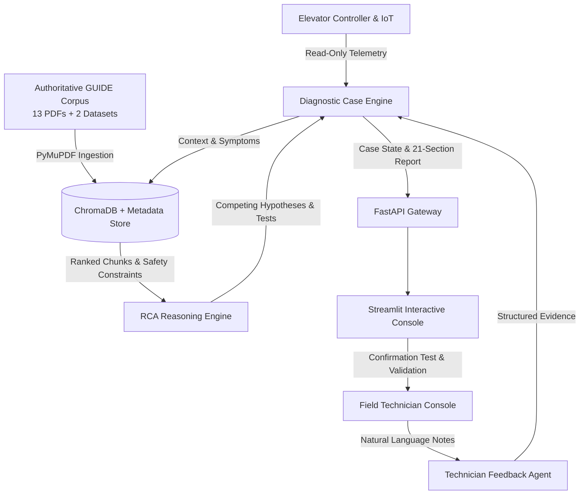

# ElevateRCA — Architecture Specification

> **Status:** Operable System Architecture  
> **Backend:** Python 3.12, FastAPI, Pydantic v2  
> **Knowledge Engine:** ChromaDB Vector Store + Hybrid Metadata Filter  
> **Safety Boundary:** Read-Only Advisory Layer (Zero Autonomous Control)

---

## 1. System Overview

ElevateRCA is an evidence-driven diagnostic intelligence layer designed for modern gearless and geared traction elevators. It bridges raw IoT telemetry/fault-alarm monitoring with structured, multi-iteration root cause analysis.

---

## 2. Core Architectural Principles

1. **Retrieved Documentation > LLM Parametric Knowledge:** Every diagnostic claim, tolerance, parameter, and procedure originates strictly from the 15 verified files in the `GUIDE/` corpus.
2. **Epistemic Humility & Principled Abstention:** If sensor or inspection evidence is ambiguous or contradictory, the system explicitly abstains (`INSUFFICIENT_EVIDENCE`) and formulates targeted physical confirmation tests.
3. **Active Alternative Elimination:** Negative evidence (e.g., absence of wear, free rotation) actively demotes or rules out candidate causes.
4. **Safety Decoupling:** ElevateRCA has zero control path to hardware, safety chains, or motor controllers.
