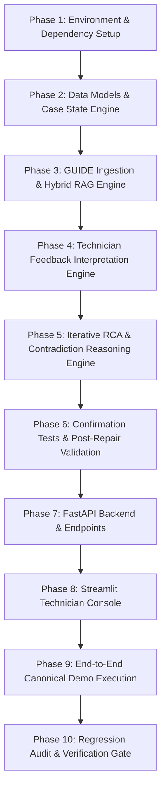

# ElevateRCA — Architecture Upgrade Plan

> **Document Version:** 1.0.0  
> **Status:** Implementation Blueprint  
> **Scope:** Repository transition from Documentation/Planning State to Fully Operable, Evidence-Grounded Diagnostic Platform

---

## 1. Executive Summary

During the architectural inspection of `d:\HACKATHONS\KONE Elevate\prototype\ElevateRCA` (Commit `5205099`), it was confirmed that:
1. The repository contains extensive planning specifications and documentation (16 research docs + 12 implementation plans + README).
2. The `GUIDE/` folder contains 13 authoritative OEM/safety PDFs and 2 structured troubleshooting datasets (15 records).
3. **Zero application code, tests, configuration manifests, or API endpoints exist.**

This Upgrade Plan defines the concrete mapping from the current state to the fully implemented, testable, human-in-the-loop diagnostic platform.

---

## 2. Component Transformation Map

Each subsystem follows the mandatory 4-stage transformation chain:
$$\text{CURRENT COMPONENT} \longrightarrow \text{REQUIRED CHANGE} \longrightarrow \text{NEW COMPONENT} \longrightarrow \text{TEST REQUIRED}$$

```
┌────────────────────────────────────────────────────────────────────────┐
│                        COMPONENT UPGRADE MATRIX                        │
└────────────────────────────────────────────────────────────────────────┘

1. KNOWLEDGE & RAG PIPELINE
   Current: Unindexed GUIDE folder (13 PDFs, 2 datasets)
      ↓
   Required Change: Build structure-aware PDF extractor, table parser, metadata tagger, hybrid indexer
      ↓
   New Component: `pipeline/rag/` (ingestion.py, parser.py, indexer.py, retriever.py)
      ↓
   Test Required: `tests/test_rag.py` (Verify 15 files indexed, metadata preserved, table retention)

2. DIAGNOSTIC CASE STATE & ITERATION
   Current: Static conceptual schemas in documentation
      ↓
   Required Change: Implement mutable, versioned, persistent DiagnosticCase with full audit history
      ↓
   New Component: `pipeline/state.py` + `db/` (SQLAlchemy / SQLite store)
      ↓
   Test Required: `tests/test_state.py` (Creation, state transitions, evidence attachment, persistence)

3. TECHNICIAN FEEDBACK & EVIDENCE ENGINE
   Current: No technician interaction mechanism
      ↓
   Required Change: Natural language interpretation agent to convert notes to structured evidence
      ↓
   New Component: `pipeline/technician.py` (Evidence extraction, polarity, opinion separation)
      ↓
   Test Required: `tests/test_technician.py` (Inspection vs. opinion, measurement normalization)

4. RCA REASONING & CONTRADICTION ENGINE
   Current: Documented Bayesian formulas without implementation
      ↓
   Required Change: Probabilistic hypothesis scoring, active negative evidence elimination, contradiction checks
      ↓
   New Component: `pipeline/rca.py` (Hypothesis lifecycle, contradiction detector, abstention)
      ↓
   Test Required: `tests/test_rca.py` (Support/contradiction updates, downgrade/rule-out, abstention)

5. DIAGNOSTIC TESTS & POST-REPAIR VALIDATION
   Current: Conceptual verification ideas in markdown
      ↓
   Required Change: Structured ConfirmationTest model + PostRepairValidation lifecycle gatekeeper
      ↓
   New Component: `pipeline/validation.py` (Test definitions, expected values, case reopen/close logic)
      ↓
   Test Required: `tests/test_validation.py` (Pass/fail handling, case closure on pass, reopen on fail)

6. API GATEWAY & DATA CONTRACTS
   Current: Markdown API tables with no HTTP server
      ↓
   Required Change: FastAPI backend with complete CRUD and diagnostic action routes
      ↓
   New Component: `api/` (main.py, routes/cases.py, routes/evidence.py, routes/validation.py)
      ↓
   Test Required: `tests/test_api.py` (Full HTTP route lifecycle, schema validation, error handling)

7. TECHNICIAN INTERACTIVE CONSOLE
   Current: Design mockups in README
      ↓
   Required Change: Full interactive Streamlit/React console with multi-iteration timeline & feedback
      ↓
   New Component: `dashboard/streamlit_app.py`
      ↓
   Test Required: `tests/test_ui_flow.py` (End-to-end case inspection, feedback submission, rerender)
```

---

## 3. Detailed Component Upgrade Blueprints

### 3.1 Knowledge & RAG Ingestion Pipeline

```
CURRENT COMPONENT:
  d:\HACKATHONS\KONE Elevate\prototype\ElevateRCA\GUIDE\
  - 13 PDFs (brake, door, ropes, SETS-01/11, KONE guide, OEM 1)
  - elevator_troubleshooting_dataset.csv
  - elevator_troubleshooting_dataset.json

REQUIRED CHANGE:
  - Extract text and preserve chapter/section/page hierarchies using PyMuPDF / PyPDF.
  - Isolate parameter tables (air gaps, timing, trip speeds) with headers intact.
  - Classify document types and assign strict authority levels (Tier 1–3).
  - Extract configuration tags (EGOV settings 8_9, A, B, D_E, F, SETS-11).
  - Ingest CSV and JSON as 15 distinct structured troubleshooting entities.
  - Build hybrid vector and metadata index (in-process ChromaDB / SQLite fallback).
  - Implement metadata-filtered and configuration-conditioned retrieval.

NEW COMPONENT:
  `pipeline/rag/parser.py`: PyMuPDF structure & table extractor
  `pipeline/rag/classifier.py`: Document & configuration tagger
  `pipeline/rag/store.py`: Vector & metadata indexing engine
  `pipeline/rag/retriever.py`: Hybrid search (semantic + exact keyword + metadata filter)

TEST REQUIRED:
  `tests/test_rag.py`:
  - `test_all_guide_files_discovered()`
  - `test_pdf_structure_and_tables_preserved()`
  - `test_troubleshooting_dataset_ingestion()`
  - `test_configuration_filtering_egov_isolation()`
  - `test_authority_ranking_tier1_precedence()`
```

---

### 3.2 Diagnostic Case State Model (`DiagnosticCase`)

```
CURRENT COMPONENT:
  docs/implementation/DATA_CONTRACTS.md (Planning definitions only)

REQUIRED CHANGE:
  - Create persistent `DiagnosticCase` dataclass/Pydantic model supporting:
    - Immutable audit log of diagnostic iterations (Iteration 1 $\rightarrow$ N).
    - Lifecycle states: `NEW` → `TRIAGED` → `UNDER_INVESTIGATION` → `RCA_PROPOSED` → `TECHNICIAN_REVIEW` → `ADDITIONAL_EVIDENCE` → `RCA_REVISED` → `DIAGNOSTIC_CONFIRMATION` → `CORRECTIVE_ACTION` → `POST_REPAIR_VALIDATION` → `CLOSED` / `RCA_REOPENED`.
    - Distinct collections for telemetry, technician observations, and OEM citations.
    - Hypothesis state tracking: `CANDIDATE`, `ACTIVE`, `SUPPORTED`, `DOWNGRADED`, `RULED_OUT`, `CONFIRMED`.

NEW COMPONENT:
  `pipeline/models.py`: Typed Pydantic models for Case, Hypothesis, Evidence, Test, Action
  `pipeline/state.py`: Case state machine and versioned persistence manager
  `db/models.py`: Relational SQLite/PostgreSQL schema for persistent cases

TEST REQUIRED:
  `tests/test_state.py`:
  - `test_case_initialization()`
  - `test_case_iteration_increment()`
  - `test_hypothesis_lifecycle_transitions()`
  - `test_audit_trail_immutability()`
```

---

### 3.3 Technician Feedback & Evidence Interpretation Agent

```
CURRENT COMPONENT:
  None (Non-existent)

REQUIRED CHANGE:
  - Parse technician natural language input:
    - Example A: "I inspected the roller. There is no visible wear."
      $\rightarrow$ Type: `PHYSICAL_INSPECTION`, Finding: `no visible wear`, Polarity: `CONTRADICTING`.
    - Example B: "The door takes 4.8 seconds to close."
      $\rightarrow$ Type: `MEASUREMENT`, Parameter: `door_closing_time`, Value: `4.8s`.
    - Example C: "I think the motor is fine."
      $\rightarrow$ Type: `TECHNICIAN_OPINION` (discounted, non-definitive).
  - Explicitly separate verified measurements from subjective impressions.
  - Link extracted findings to active candidate hypotheses.

NEW COMPONENT:
  `pipeline/technician.py`:
  - `extract_evidence_from_text(feedback_str: str) -> List[EvidenceItem]`
  - `classify_evidence_reliability(item: EvidenceItem) -> ReliabilityTier`

TEST REQUIRED:
  `tests/test_technician.py`:
  - `test_measurement_extraction_with_units()`
  - `test_negative_evidence_polarity_assignment()`
  - `test_technician_opinion_isolated_from_measurements()`
```

---

### 3.4 RCA Reasoning, Contradiction Detection & Abstention

```
CURRENT COMPONENT:
  None (Non-existent)

REQUIRED CHANGE:
  - Generate initial candidate hypotheses from affected subsystem and alarm codes.
  - Evaluate supporting, contradicting, and missing evidence for each hypothesis.
  - Down-rank or rule out hypotheses when contradictory physical evidence is presented.
  - Introduce new hypotheses if technician observations reveal unexpected symptoms.
  - Compute qualitative support tiers (`HIGH`, `MODERATE`, `LOW`, `INSUFFICIENT_EVIDENCE`).
  - Enforce Principled Abstention: Refuse to pick a single cause when evidence is ambiguous.
  - Mandate "What would change the diagnosis?" section with confirmation tests.

NEW COMPONENT:
  `pipeline/rca.py`:
  - `evaluate_hypotheses(case: DiagnosticCase, evidence: List[EvidenceItem]) -> RCASummary`
  - `detect_contradictions(hypotheses: List[Hypothesis], evidence: List[EvidenceItem])`
  - `determine_confidence_tier(hypotheses: List[Hypothesis]) -> ConfidenceStatus`

TEST REQUIRED:
  `tests/test_rca.py`:
  - `test_hypothesis_downgrade_on_contradiction()`
  - `test_alternative_cause_ruleout()`
  - `test_abstention_on_conflicting_evidence()`
  - `test_what_would_change_diagnosis_generation()`
```

---

### 3.5 Diagnostic Confirmation & Post-Repair Validation

```
CURRENT COMPONENT:
  None (Non-existent)

REQUIRED CHANGE:
  - Generate concrete confirmation test procedures with exact expected values from GUIDE.
  - Provide IF PASS / IF FAIL branching interpretations.
  - Gate case closure behind Post-Repair Validation:
    - If verification passes (fault cleared, normal cycle time, relearn complete) $\rightarrow$ `CLOSED`.
    - If verification fails $\rightarrow$ `RCA_REOPENED` with fault recurrence recorded as new evidence.

NEW COMPONENT:
  `pipeline/validation.py`:
  - `generate_confirmation_test(hypothesis: Hypothesis) -> DiagnosticTest`
  - `process_post_repair_validation(case: DiagnosticCase, outcome: ValidationResult) -> CaseState`

TEST REQUIRED:
  `tests/test_validation.py`:
  - `test_confirmation_test_derivation_from_guide()`
  - `test_case_closure_on_successful_validation()`
  - `test_case_reopening_on_failed_validation()`
```

---

### 3.6 API & Interactive Technician Console

```
CURRENT COMPONENT:
  None (Non-existent)

REQUIRED CHANGE:
  - Expose RESTful endpoints for external systems and technician clients:
    - `POST /cases`: Create initial diagnostic case
    - `GET /cases/{id}`: Inspect case state and complete iteration history
    - `POST /cases/{id}/technician-feedback`: Submit natural language observation
    - `POST /cases/{id}/diagnostic-test`: Record test pass/fail/measurement
    - `POST /cases/{id}/post-repair-validation`: Submit validation outcome
    - `GET /cases/{id}/report`: Export 21-section audit report
  - Provide an interactive web dashboard (Streamlit) featuring:
    - Active fault & telemetry display
    - Iteration timeline (Iteration 1 $\rightarrow$ 2 $\rightarrow$ 3)
    - Competing hypotheses with supporting vs. contradicting badges
    - Source document citations linking to exact PDF pages
    - Natural language feedback input box with live re-evaluation trigger

NEW COMPONENT:
  `api/main.py`: FastAPI server
  `api/routes/cases.py`: Diagnostic routes
  `dashboard/streamlit_app.py`: Field technician interface

TEST REQUIRED:
  `tests/test_api.py`:
  - `test_api_case_creation_and_retrieval()`
  - `test_api_feedback_submission_triggers_iteration()`
  - `test_api_validation_and_case_closure()`
```

---

## 4. Execution Sequence & Phasing



Every phase will be implemented incrementally with comprehensive unit tests executed before proceeding to the subsequent phase.
