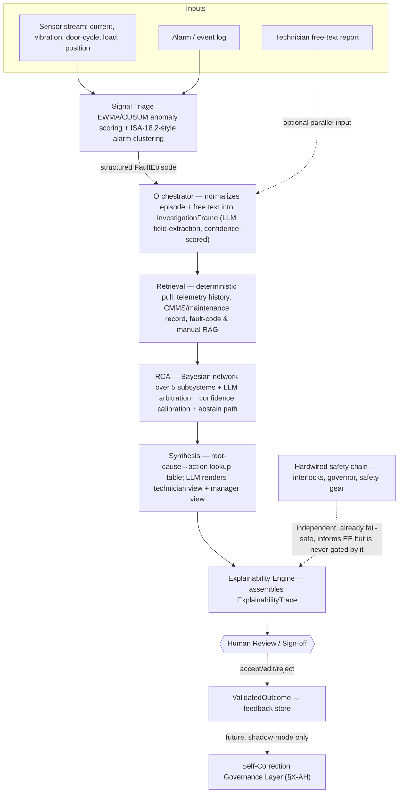

# KONE Elevate — Technical Architecture & Development Guidebook
### Autonomous Fault Isolation & Root Cause Analysis Assistant

**Evidence-category key used throughout:** `[A]` source-derived (from your proposal/reports) · `[B]` current external research · `[C]` engineering recommendation (my call) · `[D]` prototype/hackathon simplification · `[E]` deferred to future production (needs real data/SME input). Every non-obvious design choice below is tagged. Untagged prose is structural narration, not a claim.

**What this document is not:** it does not reference, reuse the name of, or assume any prior non-elevator system. Every agent and pattern below is specified fresh for this project, even where the reasoning is informed by adjacent-domain research your own reports already gathered.

---

## Table of Contents
A. Executive Technical Recommendation
B. Requirements Extracted from the Proposal
C. Problem Decomposition
D. Final Architecture (3 Phases)
E. Architecture Diagram
F. Hackathon vs. Future Production
G. Final Technology Stack
H. Technology Decision Matrix
I. Synthetic Dataset Strategy
J. Real & Adjacent Dataset Research
K. Elevator Simulator Architecture
L. Fault Injection Engine
M. Anomaly Detection
N. Alarm Correlation
O. Fault Episode Management
P. Elevator Failure-Mode Knowledge Model
Q. Bayesian / Probabilistic RCA
R. RAG Architecture
S. LLM Strategy
T. Agent / Orchestration Strategy
U. Confidence & Abstention
V. ExplainabilityTrace
W. Human-in-the-Loop
X–AH. Self-Correction Architecture (full set)
AI. Database Schema
AJ. API Specification
AK. Dashboard Design
AL. Repository Structure
AM. Development Environment
AN. Step-by-Step Implementation Guide
AO. Code Architecture — Core Classes
AP. Testing Strategy
AQ. Evaluation Metrics
AR. Five Demonstration Scenarios
AS. Self-Correction Demonstration
AT. 30-Hour Build Plan
AU. Future Production Roadmap
AV. MLOps
AW. Security & Governance
AX. Safety Boundaries
AY. Technical Risks
AZ. Overengineering to Avoid
BA. Judge-Defensibility Analysis
BB. Developer Checklist
BC. Final One-Page Stack

---

## A. Executive Technical Recommendation

Build a **five-stage deterministic pipeline with one LLM reasoning layer bolted on top of it, not a swarm of free-roaming agents**. The pipeline is: **Signal Triage → Orchestrator → Retrieval → RCA → Synthesis**, wrapped by an **Explainability Engine** that runs alongside every stage and gated by a **Human Review** step before anything reaches a person as a finished verdict `[A]`. This matches your proposal's own architecture diagram exactly — nothing here replaces it; this document makes it buildable.

The single most important engineering decision, and the one every other choice below serves, is: **numeric evidence is computed by deterministic code; the LLM only arbitrates between hypotheses that deterministic code has already scored, and writes the human-facing explanation.** This is not a stylistic preference — it is the one pattern your own research reports found directly validated in the closest published architecture to this project: a 2025 industrial-fault-diagnosis paper that paired a Bayesian-network diagnostic engine with an LLM "arbitration" layer holding authority to override the network's verdict when the raw evidence disagreed, calibrated with Temperature Scaling, with a hard abstain-to-human path — and measured accuracy rising from 67.1% (rule engine alone) to 95.7% with the arbitration layer added, and calibration error (ECE) dropping by more than 75% `[B, arXiv:2510.03815]`. That is your RCA Agent, essentially as-is.

Second-most-important decision: **the safety-critical stop already happened, independent of this software, before your system ever runs.** A hardwired relay safety chain — physically separate from any PLC or software layer — is what actually stops an elevator; U.S. federal mine-safety documentation states this explicitly for microprocessor-controlled elevators: "faults in the solid state devices or software programming will not result in unsafe operation of the elevator" `[B, MSHA]`. This one fact is what turns "real-time diagnosis of a safety-critical machine" from a hard control-systems problem into a much more tractable one: your system explains and recommends, in seconds-to-minutes, after the hardware has already failed safe. Say this explicitly to judges — it is your strongest, most concrete answer to "how is this safe."

Third: **do not pitch sensor-connected AI as the novelty.** KONE, Otis, Schindler, and TK Elevator all run production connected-maintenance platforms today, and KONE already ships a generative-AI Technician Assistant (AWS Bedrock, confirmed running on Anthropic's Claude models) `[A confirmed by B]`. TK Elevator announced a full agentic-AI layer (Azure AI + Databricks, multiple collaborating agents, digital twins, 30-day failure prediction) on **April 17, 2026** `[B]`. None of the four public platforms describe a schema-validated, fully auditable, evidence-cited reasoning trace comparable to what your `ExplainabilityTrace` produces. That gap — not "AI for elevators" — is your differentiator, and section BA turns it into judge-ready answers.

---

## B. Requirements Extracted from the Proposal

Pulled directly from your Idea Proposal and the three supplied research reports — nothing here is invented `[A]`:

| Requirement | Source |
|---|---|
| Correlate alarms/events in the same time window into one fault episode before diagnosing | Proposal §"Proposed Solution"; all 3 reports independently converge on ISA-18.2-style alarm-flood rationalization as the mechanism |
| Use an elevator-specific fault tree + Bayesian reasoning, not raw fault-code lookup | Proposal §"Proposed Solution"; reports §2 (all three) |
| Rank causes with confidence, show evidence, explain why alternatives were ruled out | Proposal §"Proposed Solution" and "Key Differentiators" |
| Recommend corrective action from a lookup table, not LLM invention | Proposal (implicit in "recommends...based on...available maintenance knowledge"); reports §7 explicit ("never let the LLM invent") |
| Two output renderings — technician-depth, building-manager-plain-language — from one evidence trail | Proposal §"Proposed Solution"; reports §6 (all three), citing Otis ONE's "Personas" as real-world precedent |
| Explainable, auditable reasoning trail | Proposal, "Key Differentiators" #4, #6; reports §5–6 identify this as the actual competitive gap |
| Strictly advisory — no control of motor, brake, door locks, safety circuit | Proposal, stated four times across the document; reports §1.3/§7.2 ground this in EN 81-20 / ASME A17.1 / MSHA |
| Deterministic retrieval + AI reasoning, not a single general-purpose LLM doing diagnosis | Proposal §"Explainability & Safety" |
| Five subsystems: Drive/Motor, Door, Brake/Traction, Controller/Safety-Circuit, Sensors | Proposal architecture figures; reports use the same decomposition (occasionally adding Environmental, which we fold into Sensors, §P) |
| Human review/sign-off gate before any action | Proposal, Agent Design table; reports §7 (split into two paths — see §W) |
| Currently architecture/design stage; prototype + synthetic scenario testing are the next steps | Proposal Executive Summary and Future Roadmap |
| KONE-specific fault mappings are illustrative pending SME input | Proposal "Current Assumptions & Limitations" |

**What the proposal leaves open, that this document decides:** exact tech stack, exact anomaly-detection method, exact Bayesian-network structure, database schema, API shape, self-correction mechanics, and the build sequence. Everything in that list is `[C]` or `[D]` below unless cited otherwise.

---

## C. Problem Decomposition

| Layer | Input | Processing | Algorithm | Output | Classification | Typical Latency | Human Involvement |
|---|---|---|---|---|---|---|---|
| Ingestion | Raw sensor stream, controller alarm/event log | Parse, timestamp-normalize, unit-check | Schema validation | Clean typed events | Deterministic | <10 ms/event | None |
| Signal Triage | Clean events | Per-signal statistical scoring against a rolling per-unit baseline | EWMA/CUSUM changepoint (§M) | Anomaly score + candidate alarm cluster | Statistical | 10s of ms | None |
| Alarm Correlation | Anomaly scores + alarm log | Group temporally/causally related alarms into one episode | ISA-18.2-style rationalization graph (§N) | One `FaultEpisode` per real event, not per alarm | Deterministic + statistical | <1 s | None |
| Orchestrator | `FaultEpisode` + optional technician free text | Normalize into a structured investigation frame | LLM field-extraction with per-field confidence | `InvestigationFrame` | LLM-based (narrow, structured-output only) | 1–3 s | None |
| Retrieval | `InvestigationFrame` | Deterministic keyed lookup: telemetry history, CMMS/maintenance record, manuals/fault-code RAG | Rule-based queries + vector search | `EvidenceBundle` | Deterministic + retrieval-based | 1–3 s | None |
| RCA | `EvidenceBundle` | Score every subsystem hypothesis against the fault tree/Bayesian network; LLM arbitrates ties/conflicts | Bayesian network + LLM arbitration (§Q) | Ranked hypotheses + confidence | Probabilistic + LLM-based | 2–5 s | None (but abstains to human below threshold) |
| Synthesis | Ranked hypotheses | Map root cause → corrective action via fixed lookup; render two audiences | Lookup table + LLM wording only | Technician report + manager status | Knowledge-based + LLM-based (wording only) | 1–2 s | None |
| Explainability | Every stage's intermediate output | Assemble structured trace | Schema assembly (§V) | `ExplainabilityTrace` | Deterministic | <100 ms | None |
| Human Review | Full trace | Technician reads, accepts/edits/rejects | — | `ValidatedOutcome` | Human-controlled | Minutes | **Total** — nothing downstream acts without this |

**Failure modes per layer**, briefly: Ingestion — malformed/missing fields (reject + flag, never guess a value). Triage — false positive from a benign transient (mitigated by requiring sustained deviation, not a single sample, §M). Correlation — under- or over-clustering (mitigated by a conservative time window + explicit causal-link table, §N). Orchestrator — misextracted field (mitigated by confidence-per-field + a required-fields check that blocks progression, not a guess). Retrieval — stale or missing CMMS record (surfaced as "evidence unavailable," which lowers RCA confidence rather than silently proceeding). RCA — genuinely ambiguous evidence (abstains, §U). Synthesis — no lookup-table entry for a novel root cause (flagged as a knowledge gap, §AF, never invented). Human Review — reviewer fatigue/rubber-stamping (mitigated by making the trace short enough to actually read — see §V's design goal).

---

## D. Final Architecture

### Phase 1 — Hackathon Prototype (this document's primary target)
Single-process Python service, synthetic simulator standing in for real telemetry, SQLite/Postgres for state, a lightweight statistical anomaly detector, a from-scratch Bayesian network sized to the five subsystems, one LLM call per investigation for arbitration + synthesis, a Streamlit or lightweight React dashboard. No message bus, no Kubernetes, no fine-tuning. Everything runs locally or on one small cloud VM.

### Phase 2 — Pilot Deployment
Multiple real elevators feeding a real message bus (e.g., MQTT from building gateways), a managed Postgres/TimescaleDB instance, the same reasoning pipeline now horizontally scaled per-building, a real CMMS integration replacing the synthetic maintenance-history table, and the self-correction feedback loop (§X–AH) turned on in **shadow mode only** (logs disagreements, changes nothing yet).

### Phase 3 — Production-Grade Self-Correcting Platform
Fleet-scale ingestion, a model/knowledge registry with versioning, champion–challenger evaluation, drift monitoring, and a governed approval workflow before any recalibration reaches production — detailed in §X–AH. This phase requires real KONE data and SME sign-off; nothing in Phase 3 should be attempted with synthetic data alone `[E]`.

**Why this phasing, not a different one `[C]`:** the proposal itself states the project is "at the architecture and design stage" with prototype + synthetic testing as declared next steps. Building Phase 3 machinery now would be solving a data-availability problem you don't have data for yet — your reports independently confirm no public, real, root-cause-labeled elevator dataset exists `[A, all 3 reports §4]`. Phase 1 is sized to what a 30-hour build can actually finish and defend.

---

## E. Architecture Diagram



---

## F. Hackathon vs. Future Production

| Dimension | Hackathon (Phase 1) | Future Production (Phase 3) |
|---|---|---|
| Data source | Physics-based synthetic simulator + real adjacent datasets (§I, §J) | Real KONE telemetry + fault-labeled history, KONE SME-validated |
| Anomaly detection | Statistical thresholding / EWMA (§M) | Same baseline, possibly upgraded to LSTM-AE once enough labeled normal-operation data exists |
| RCA engine | Hand-built Bayesian network, 5 subsystems, priors from literature | Same structure, CPTs re-estimated from real incident data, SME-reviewed |
| LLM role | Arbitration + wording, single provider, single model | Same role; may add a smaller/cheaper model for high-volume triage and reserve the frontier model for genuinely ambiguous cases |
| Self-correction | Not live — a scripted demo only (§AS) | Full governed closed loop (§X–AH), shadow → canary → production |
| Infra | One process, SQLite/Postgres, no message bus | Message bus (Kafka/equivalent) only if throughput actually requires it, managed DB, model registry |
| Explainability | Full `ExplainabilityTrace`, same schema as production | Same schema — this does not change between phases, by design |
| Human gate | Manual review UI | Same, plus an audit log retained for compliance |

---

## G. Final Technology Stack

One choice per layer, decisive, per your own instruction not to be handed a pile of alternatives.

| Layer | Final Technology | Why (short) |
|---|---|---|
| Language | Python 3.12 | Every library below is Python-native; no reason to split languages for a 30-hour build `[C]` |
| Backend/API | FastAPI | Native async, automatic OpenAPI generation (feeds §AJ directly), Pydantic v2 built in for schema validation — which you need everywhere anyway (§V) `[C]` |
| Data processing | Pandas + NumPy | Standard, fast enough at hackathon data volumes; Polars is faster but adds a second API surface to learn under time pressure for no real benefit at this scale `[C]` |
| Anomaly detection | Hand-rolled EWMA/CUSUM (NumPy) | Zero training data required, sub-millisecond, fully explainable, and directly matches what all three of your reports independently recommend as the load-bearing baseline `[A, all 3 reports §3.1]` |
| Streaming/ingestion | Async Python queue (`asyncio.Queue`) feeding the pipeline | A message broker (Kafka/MQTT) solves a scale problem you don't have yet — see §AZ |
| Database | PostgreSQL (via SQLAlchemy) | One database for everything (telemetry, events, episodes, traces) keeps the build simple; add TimescaleDB's extension later only if raw telemetry volume actually demands it (§AU) `[C]` |
| Vector store | Chroma (embedded, in-process) | Zero infra to stand up, persists to disk, sufficient for a small manuals/fault-code corpus; swap for Qdrant/pgvector in Phase 2 if the corpus grows `[C]` |
| RCA engine | `pgmpy` (Python Bayesian-network library) | Purpose-built for exactly this — define nodes/CPTs, run exact or approximate inference, no need to hand-write belief propagation `[C]` |
| LLM | Claude (Anthropic API) — see §S for the reasoning | Strongest currently-available structured-output/tool-calling reliability for this kind of constrained arbitration task `[B]`, see §S for the full comparison |
| Agent orchestration | Plain Python function calls, no framework | See §T — a framework buys you nothing here that five typed functions don't already give you |
| Frontend | React + Tailwind (or Streamlit if time is short) | React for a polished judge-facing dashboard; Streamlit as the fallback if the team is backend-heavy and frontend hours are scarce `[C]` |
| Visualization | Recharts (React) / Plotly (Streamlit) | Standard, no reason to deviate |
| Containerization | Docker Compose (API + Postgres, two containers) | Enough to make the demo reproducible on any laptop; no Kubernetes (§AZ) |
| Testing | pytest | Standard |
| Evaluation | Custom scoring scripts against the labeled synthetic scenarios (§AR) | No existing benchmark harness fits this domain |
| Future MLOps | MLflow (model registry) + a simple approval workflow | Only stood up in Phase 2+; not needed for Phase 1 (§AV) |
| Future drift detection | `river` (Python online-ML library) for streaming statistics | Lightweight, matches the "statistical-first" philosophy carried through this whole document `[E]` |
| Future continual learning | Not recommended at all — see §AZ | — |
| Future model registry | MLflow Model Registry | Same tool as above, avoids adding a second system |

---

## H. Technology Decision Matrix

Condensed — only where a real trade-off exists (the table above already made the call everywhere else):

| Decision | Option chosen | Runner-up | Why chosen over runner-up |
|---|---|---|---|
| RCA core | Bayesian network (`pgmpy`) | Pure LLM reasoning, no structured model | A BN gives calibratable, auditable posterior probabilities over causes; an LLM alone cannot give you a defensible confidence number — this is the exact finding your reports cite from the R2Act benchmark (91–99.7% diagnosis accuracy but only 36.8–60.3% valid recommended actions when a single LLM pass owns both) `[A/B]` |
| Anomaly detector | Statistical (EWMA/CUSUM) | LSTM-autoencoder | LSTM-AE has a real elevator precedent (98.33% accuracy in one IoT study, `[A, report 1 §3.1]`) but needs clean training data your team doesn't have in 30 hours; statistical is a defensible, sourced choice, not a corner cut `[A]` |
| Vector DB | Chroma | Qdrant / pgvector | Chroma needs zero setup for a corpus this small; Qdrant/pgvector earn their keep at a scale this prototype won't reach |
| Orchestration | Plain functions | LangGraph | LangGraph is justified once you have >5 agents with genuinely dynamic routing; you have 5 agents with a **fixed** sequence — a framework here adds abstraction without solving a problem you have (§T) |
| DB | PostgreSQL | MongoDB | Your data is relational by nature (elevator → episode → hypothesis → evidence, all foreign-keyed); forcing it into documents fights the schema instead of expressing it |
| Message transport | In-process async queue | Kafka | Kafka is the right tool once you have multiple independent consumers at fleet scale (Phase 2+); one process reading one queue does not need a distributed log |

---

## I. Synthetic Dataset Strategy `[D]`

The dataset backing the demo has four layers, generated together so every fault has a machine-checkable ground truth:

1. **Baseline physics model** — a simple first-order model per subsystem (not a full multibody simulation): motor current as a function of commanded torque + load + a small noise term; door-cycle time as a function of a nominal cycle time + wear coefficient; brake-release/apply timing as a function of a nominal timing + degradation coefficient. This is deliberately not physically exhaustive — it only needs to be *plausible enough* that an injected fault produces the textbook signature a real technician would recognize, which is exactly the standard your reports document HVAC-FDD and wind-turbine research using when real fault data isn't available `[A, report 2 §4.2]`.
2. **Fault injection** — see §L for the mechanism and the specific fault library.
3. **Correlated alarm generation** — when a fault crosses threshold, deterministically fire the alarm cascade a real controller would generate (e.g., mechanical jam → overcurrent alarm → drive trip → door-zone/leveling alarm), so the Signal Triage / Alarm Correlation stages have something real to cluster.
4. **Maintenance history table** — a small synthetic CMMS table (prior repairs, part ages, callback history) seeded so the Retrieval Agent has something to pull and so Bayesian priors can plausibly be informed by history (§37 in your roadmap's own framing).

**Every synthetic record carries a `ground_truth_fault_id`, injected `start_time`/`end_time`, and `expected_alarms` list** so evaluation (§AQ) can be fully automated rather than eyeballed.

---

## J. Real & Adjacent Dataset Research `[A/B]`

Your own reports already did this research well; here is the consolidated, cross-checked list, ranked by fit — verified live during this session where marked.

| Dataset | What it actually is | Elevator-specific? | Use here |
|---|---|---|---|
| **Huawei Elevator Predictive Maintenance Dataset** (Kaggle: `shivamb/elevator-predictive-maintenance-dataset`; canonical source: GitHub `omlstreaming/grc-datasets-pred-maintenance`, Zenodo DOI `10.5281/zenodo.3653909`) | Real elevator **door-system** IoT data — door ball-bearing (electromechanical), humidity, vibration — sampled at 4 Hz during peak usage windows. **Verified live this session — real, accessible, DOI-registered.** | **Yes — genuinely elevator-specific**, but door-subsystem only, not full-elevator telemetry | Primary source for the Door subsystem's anomaly-detector validation. Do not describe it as covering the whole elevator — it doesn't. |
| **NASA PCoE — IGBT Accelerated Aging Dataset** (Celaya, Wysocki & Goebel, 2009) | Thermal-overstress life data on IGBTs | No (adjacent — power electronics, not elevator-specific) | Drive/motor subsystem's IGBT-failure-signature stand-in `[A]` |
| **NASA PCoE — IMS/Rexnord Bearing Dataset** (2007) | Run-to-failure vibration data, rolling-element bearings | No (adjacent) | Motor-bearing / door-roller wear signature stand-in `[A]` |
| **CWRU Bearing Data Center** | Vibration data, seeded inner/outer-race/ball faults at 12/48 kHz | No (adjacent, but the field's most-used benchmark) | Secondary drive/motor bearing stand-in; verified live this session (`engineering.case.edu/bearingdatacenter`) |
| **NASA C-MAPSS** | Turbofan run-to-failure simulation, multivariate degrading sensors | No | Legitimate stand-in to demo the anomaly-detection *pipeline architecture* — label it "engine-domain proof of pipeline" to judges, never as elevator data `[A]` |
| **AI4I 2020** (UCI, DOI `10.24432/C5HS5C`) | Synthetic-but-realistic generic industrial dataset, 5 labeled failure modes | No | Fallback generic classifier-validation set if the bespoke simulator (§K) falls behind schedule |

**No public dataset pairs real elevator telemetry with confirmed, expert-validated root-cause labels.** All three of your reports independently reached this conclusion by different search paths, which is itself reasonably strong evidence it's a genuine field-wide gap, not a search miss `[A, convergent across reports]`. State this to judges as the reason the prototype leans on physics-grounded synthetic data — it's the same justification the peer-reviewed elevator literature itself uses (the 2024 *Nature* PINN-e-RGCN paper built its own hybrid real+simulated dataset for exactly this reason) `[A]`.

---

## K. Elevator Simulator Architecture `[D]`

A single Python class per subsystem, each exposing `.step(dt)` and `.inject_fault(fault_type, severity, start_time)`:

```python
class SubsystemSimulator(Protocol):
    def step(self, dt: float, command: dict) -> dict: ...        # returns sensor readings for this tick
    def inject_fault(self, fault_type: str, severity: float, start_time: float) -> None: ...
    def active_faults(self) -> list[dict]: ...                    # ground truth, for evaluation only
```

Five concrete implementations (`DriveMotorSim`, `DoorSim`, `BrakeTractionSim`, `ControllerSafetySim`, `SensorEnvSim`) compose into one `ElevatorSimulator` that ticks all five each step, merges their outputs into one telemetry frame, and independently runs a small `AlarmGenerator` that watches thresholds and fires the deterministic alarm cascade described in §I.3. A `Scenario` object (§L, §AR) wraps the simulator with a scripted timeline: run normal for N seconds, inject fault X at time T, run for M more seconds, done — this is what both the demo and the automated evaluation (§AQ) run against.

---

## L. Fault Injection Engine `[D]`

Each fault type is a small, named function that perturbs one or more of the simulator's output signals in a way that mirrors the real literature-documented signature (§1's upstream-cause chains), not an arbitrary spike:

| Fault | Subsystem | Signal perturbation | Real-world signature it mirrors |
|---|---|---|---|
| `igbt_overcurrent` | Drive/Motor | Step increase in motor current RMS + rising crest factor | VFD overcurrent trip; IGBT stress `[A]` |
| `mechanical_jam` | Drive/Motor | Current rises with torque demand but no drive-internal fault flag | Distinguishes from `igbt_overcurrent` exactly as the disconnect-and-retest field procedure in your reports does `[A]` |
| `door_photoeye_drift` | Door | Intermittent sensor-state flicker, rising door-cycle time, repeated reopen events | Photo-eye/light-curtain contamination `[A]` |
| `door_roller_wear` | Door | Gradual (not step) rise in door motor current + cycle time over the scenario | Roller/bearing wear `[A]` |
| `encoder_drift` | Sensors | Position-vs-commanded deviation growing over time | Encoder contamination/drift, leveling errors `[A]` |
| `brake_timing_violation` | Brake/Traction | Brake-release/apply timing exceeds threshold while motor torque stays normal | Direct match to the patented drive-brake interlock timing check in report 3 §1.2 `[A]` |
| `safety_chain_trip` | Controller/Safety-Circuit | Single discrete "chain open" event, everything downstream inhibited | Fail-safe design — one open contact anywhere halts the car `[A]` |
| `intermittent_fault` | Any | Fault flag toggles on/off across the scenario at random intervals | Controller/PLC relay-contact degradation, "notoriously difficult to isolate" per your reports `[A]` |
| `sensor_noise_burst` | Sensors | Short-duration high-variance noise with no underlying fault | Negative control — exists specifically to test that Signal Triage doesn't over-trigger |
| `simultaneous_cascade` | Multiple | Fires 2 of the above within one alarm-correlation window | Direct test of §N — the exact "overcurrent + door fault + trip" scenario your proposal itself opens with |

Every injected fault writes a `FaultGroundTruth` row (fault_id, subsystem, component, root_cause, start/end time, severity, affected_signals, expected_alarms) the moment it's injected — this is what makes §AQ's evaluation automatic instead of manual.

---
## M. Anomaly Detection

**Design.** Per-signal, per-unit EWMA with a CUSUM-style sustained-deviation check, run against a rolling baseline established over the unit's own recent history — not a fleet-wide global threshold. This mirrors how production elevator IoT platforms actually operate (your reports cite a 30-day per-unit baselining window as the documented commercial pattern `[A]`) and avoids flagging a unit that has always run slightly differently as anomalous. Context matters more than the raw threshold: a current reading that's abnormal while stationary is normal while accelerating, so every signal is scored against a baseline conditioned on operating state (idle / accelerating / constant-speed / decelerating / door-open).

**Why not deep learning here `[C]`:** your own reports are unanimous — an LSTM-autoencoder needs a clean, sufficiently long "normal" training window and meaningful periodicity to be worth its complexity; without either (true for a 30-hour build with a fresh simulator), a statistical/changepoint method actually outperforms it in the literature they cite `[A]`. Keep it as a labeled stretch goal, not the load-bearing detector.

```python
from dataclasses import dataclass
from collections import deque

@dataclass
class SignalBaseline:
    ewma: float
    ewma_var: float
    alpha: float = 0.05          # smoothing factor — tune per signal
    cusum_pos: float = 0.0
    cusum_neg: float = 0.0
    k: float = 0.5                # CUSUM slack, in std-devs
    h: float = 5.0                # CUSUM alarm threshold, in std-devs

def update_and_score(baseline: SignalBaseline, value: float, operating_state: str) -> dict:
    """Returns an anomaly score in [0,1] plus the raw statistics, for one signal reading."""
    dev = value - baseline.ewma
    baseline.ewma += baseline.alpha * dev
    baseline.ewma_var = (1 - baseline.alpha) * (baseline.ewma_var + baseline.alpha * dev ** 2)
    std = max(baseline.ewma_var ** 0.5, 1e-6)

    z = dev / std
    baseline.cusum_pos = max(0.0, baseline.cusum_pos + z - baseline.k)
    baseline.cusum_neg = max(0.0, baseline.cusum_neg - z - baseline.k)
    sustained = max(baseline.cusum_pos, baseline.cusum_neg) > baseline.h

    return {
        "z_score": z,
        "sustained_deviation": sustained,
        "anomaly_score": min(abs(z) / baseline.h, 1.0),
        "operating_state": operating_state,
    }
```

A reading only becomes a candidate alarm when `sustained_deviation` is true — a single noisy sample never fires anything, which is the direct fix for the `sensor_noise_burst` negative-control scenario in §L.

---

## N. Alarm Correlation

**Design.** Borrowed directly and explicitly from industrial alarm-flood management (ISA-18.2 / EEMUA-191), which your reports identify as a solved version of exactly this problem: group alarms/anomaly events that fall within a short rolling time window **and** share a plausible causal link (from a small static subsystem-dependency table) into one `FaultEpisode`; the earliest-timestamped alarm in the cluster is treated as the probable primary event, the rest as consequences to be explained, not separately diagnosed `[A, all 3 reports §2.3]`.

```python
CAUSAL_LINKS = {
    # (primary_alarm_type) -> set of alarm types it plausibly cascades into
    "motor_overcurrent": {"drive_trip", "safety_chain_trip", "door_zone_fault"},
    "door_obstruction":  {"door_close_timeout", "safety_chain_trip", "drive_start_inhibited"},
    "brake_timing_violation": {"safety_chain_trip", "position_deviation"},
    "encoder_fault": {"leveling_error", "position_deviation"},
}
CORRELATION_WINDOW_SECONDS = 15   # [D] — tune against real controller log timing once available

def cluster_alarms(alarms: list[dict]) -> list[dict]:
    """alarms: [{'type': str, 'timestamp': float, 'unit_id': str}, ...], sorted by timestamp."""
    episodes = []
    for alarm in sorted(alarms, key=lambda a: a["timestamp"]):
        placed = False
        for ep in episodes:
            if alarm["unit_id"] != ep["unit_id"]:
                continue
            within_window = alarm["timestamp"] - ep["primary"]["timestamp"] <= CORRELATION_WINDOW_SECONDS
            causally_linked = alarm["type"] in CAUSAL_LINKS.get(ep["primary"]["type"], set())
            if within_window and causally_linked:
                ep["consequences"].append(alarm)
                placed = True
                break
        if not placed:
            episodes.append({"unit_id": alarm["unit_id"], "primary": alarm, "consequences": []})
    return episodes
```

This directly resolves the scenario your proposal opens with: door obstruction → door-close timeout → safety-circuit trip → drive-start inhibited becomes **one** `FaultEpisode` with `primary = door_obstruction`, not four independent investigations.

**Why a static causal-link table, not a learned graph `[C, D]`:** ISA-18.2 rationalization in real plants is built from documented process connectivity, not learned from data — your reports note this is the mainstream, non-ML pattern `[A]`. For a domain with five known subsystems and no labeled cascade data, a small hand-built table is more defensible and auditable than a graph a model invented from too little data. Extending it with a learned/statistical correlation layer (co-occurrence matrices, transfer entropy — both cited in your reports `[A]`) is a legitimate Phase 2 upgrade, not a Phase 1 requirement.

---

## O. Fault Episode Management

A `FaultEpisode` is the unit of work the rest of the pipeline operates on — one episode, one investigation, regardless of how many alarms fed into it. State machine:

```
OPEN (just clustered) → TRIAGED (Orchestrator has produced an InvestigationFrame)
                        → EVIDENCE_GATHERED (Retrieval complete)
                        → DIAGNOSED (RCA has a ranked hypothesis set)
                        → SYNTHESIZED (recommendation + both renders exist)
                        → UNDER_REVIEW (waiting on a human)
                        → CLOSED (human accepted/edited/rejected — ValidatedOutcome written)
```

Multiple episodes can be `OPEN` concurrently across different units (or even the same unit, if a second unrelated fault fires mid-investigation) — this is the concrete fix for the batch-vs-concurrent gap your reports flag `[A]`: the pipeline itself stays sequential *per episode*, but episodes themselves run as independent instances, so one slow investigation never blocks a new alarm on a different unit from starting its own.

---

## P. Elevator Failure-Mode Knowledge Model

A small, versioned, human-readable YAML file is the right format here `[C]` — not a graph database, not a second Postgres schema. It is small (five subsystems, a bounded set of failure modes each), needs to be readable and editable by a non-engineer (a KONE SME, eventually), and needs to be loadable straight into the Bayesian network's structure (§Q) and the Synthesis Agent's lookup table (§AO) without a translation layer.

```yaml
# knowledge/failure_modes.yaml  — [D] illustrative content; KONE SME review required before any real use, per your proposal's own stated limitation
subsystems:
  drive_motor:
    components: [igbt_module, motor_windings, motor_cable, vfd_parameters]
    failure_modes:
      - id: igbt_short
        component: igbt_module
        symptoms: [motor_overcurrent, drive_internal_fault_flag]
        telemetry_signature: {motor_current_rms: high, current_crest_factor: high}
        prior_probability: 0.25          # [D] literature-informed placeholder, not KONE-validated
        corrective_action: replace_igbt_module
      - id: mechanical_jam
        component: guide_system
        symptoms: [motor_overcurrent]
        telemetry_signature: {motor_current_rms: high, drive_internal_fault_flag: false}
        prior_probability: 0.35
        corrective_action: inspect_and_clear_mechanical_obstruction
  door:
    components: [photo_eye, roller_bearing, door_lock_contact, door_encoder]
    failure_modes:
      - id: photoeye_drift
        component: photo_eye
        symptoms: [door_close_timeout, repeated_reopen]
        telemetry_signature: {photoeye_state: unstable}
        prior_probability: 0.30
        corrective_action: clean_recalibrate_photoeye
  # brake_traction, controller_safety_circuit, sensors follow the same shape
```

Every `corrective_action` value is a key into the fixed lookup table the Synthesis Agent uses (§AO) — the knowledge file and the action table are deliberately the same source of truth, so there is no way for a root cause to exist without a corresponding, pre-approved action.

---

## Q. Bayesian / Probabilistic RCA

**Method comparison, decisively resolved.** FTA and FMEA are excellent for *building* the failure-mode library (§P) but are static and don't natively combine partial/uncertain/correlated evidence — a real weakness the moment two subsystems' symptoms overlap. A Bayesian network, converted directly from that same fault/failure-mode structure, does exactly what's needed: it takes whatever evidence has actually arrived (possibly incomplete, possibly noisy) and produces a posterior probability over every candidate root cause, updating cleanly as more evidence comes in `[A, all 3 reports §2, converging independently]`. This is not a from-scratch model — it is your §P knowledge file, formalized.

**Structure**, per subsystem:

```
Root Cause  →  Failure Mode  →  Affected Component  →  Observable Symptom  →  Telemetry Evidence / Alarm Evidence
```

```python
from pgmpy.models import DiscreteBayesianNetwork
from pgmpy.factors.discrete import TabularCPD
from pgmpy.inference import VariableElimination

# Simplified drive/motor sub-network — full network composes one of these per subsystem
model = DiscreteBayesianNetwork([
    ("root_cause", "current_signature"),
    ("root_cause", "drive_internal_fault_flag"),
])

# Priors drawn from knowledge/failure_modes.yaml — [D] literature-informed, not KONE-validated
cpd_cause = TabularCPD("root_cause", 3, [[0.25], [0.35], [0.40]],
                        state_names={"root_cause": ["igbt_short", "mechanical_jam", "other"]})

cpd_current = TabularCPD(
    "current_signature", 2,
    [[0.90, 0.85, 0.10],   # P(high | igbt_short), P(high | jam), P(high | other)
     [0.10, 0.15, 0.90]],
    evidence=["root_cause"], evidence_card=[3],
    state_names={"current_signature": ["high", "normal"], "root_cause": ["igbt_short", "mechanical_jam", "other"]},
)
cpd_flag = TabularCPD(
    "drive_internal_fault_flag", 2,
    [[0.80, 0.05, 0.05],
     [0.20, 0.95, 0.95]],
    evidence=["root_cause"], evidence_card=[3],
    state_names={"drive_internal_fault_flag": ["true", "false"], "root_cause": ["igbt_short", "mechanical_jam", "other"]},
)
model.add_cpds(cpd_cause, cpd_current, cpd_flag)
model.check_model()

infer = VariableElimination(model)
posterior = infer.query(
    variables=["root_cause"],
    evidence={"current_signature": "high", "drive_internal_fault_flag": "false"},
)
# → mechanical_jam now the dominant posterior, exactly matching the field disconnect-and-retest
#   isolation procedure your reports document [A]
```

**The LLM arbitration layer sits directly on top of this**, and its job is narrow and specific, following the validated pattern from arXiv:2510.03815 `[B]`: given the BN's posterior *and* the raw evidence bundle, (1) verify the BN's top hypothesis isn't contradicted by evidence the network wasn't structured to weigh (e.g., a maintenance-history note the retrieval agent found), (2) if the BN and the raw evidence disagree, decide which one is right and say why, (3) if genuinely unresolved, abstain (§U). **The LLM never assigns the posterior probability itself** — it only accepts, overrides-with-cited-justification, or abstains. This is what keeps "numeric reasoning must originate from computed evidence" true in practice, not just as a stated rule.

---

## R. RAG Architecture

**Is RAG necessary? Yes, narrowly** — for one thing only: grounding "what does this fault code / symptom combination usually mean, and what's the documented corrective procedure" in real text, without fine-tuning. It is not used for telemetry reasoning (that's the BN's job) and it never overrides a telemetry-grounded verdict — this is a direct, explicit response to a finding in your reports: a 2025 multi-agent RCA study found plain RAG inflates false positives specifically when a plausible-sounding retrieved passage isn't checked against the actual physical evidence `[A/B, MA-RCA]`.

**Pipeline:** ingest a small corpus (synthetic fault-code glossary + generic VFD/door/brake troubleshooting references, clearly labeled illustrative per §P) → chunk by section heading → embed (a standard sentence-embedding model, e.g. `text-embedding-3-small`-class) → store in Chroma → at query time, retrieve top-k by the RCA Agent's current leading hypothesis + subsystem, not by raw alarm text (raw alarm text alone under-constrains the query) → every retrieved chunk is attached to the `ExplainabilityTrace` with its source, so a citation is never presented without a traceable origin.

```python
def retrieve_evidence(hypothesis: str, subsystem: str, k: int = 3) -> list[dict]:
    query = f"{subsystem} {hypothesis} diagnostic procedure corrective action"
    results = chroma_collection.query(query_texts=[query], n_results=k)
    return [
        {"text": doc, "source": meta["source"], "section": meta["section"]}
        for doc, meta in zip(results["documents"][0], results["metadatas"][0])
    ]
```

No fabricated official KONE documentation goes into this corpus — synthetic/illustrative content only, labeled as such in its own metadata field, so the Explainability Engine can (and should) tag every citation `synthetic` or `public-reference` and never let the two look identical to a reader (§V).

---
## S. LLM Strategy

**Current landscape, verified live this session (Sept 2026 — this space moves in weeks, sanity-check at build time) `[B]`:** Anthropic's current lineup is Claude Opus 5, Claude Sonnet 5, and Claude Haiku 4.5, with Claude Fable 5.1 as the top-of-line model (released Sept 1, 2026, currently leading third-party coding/agent benchmarks). OpenAI's current flagship is GPT-6 Astra (Sept 3, 2026), succeeding the GPT-5.6 family. Google's current line is Gemini 3.8 Flash / Gemini 3.1 Pro. All of these, plus strong open-source options (DeepSeek-V4, Qwen3.8), now support structured outputs and tool/function calling to varying degrees of reliability.

**Recommendation: Claude (Sonnet-tier for the RCA-arbitration and Synthesis calls; Haiku-tier as a cost-reduction option for the Orchestrator's simpler field-extraction call if request volume ever becomes a cost concern) `[C]`.** Reasoning, not brand preference:
- **Structured-output and tool-calling reliability matters more here than raw benchmark position** — every call this system makes to an LLM (§Q's arbitration, §AO's field-extraction, §AO's synthesis wording) must return a schema-validated object, not free text, or the whole "numeric evidence first, LLM second" discipline breaks down the first time a response doesn't parse.
- **KONE's own production Technician Assistant already runs on Claude via Amazon Bedrock** `[A/B, confirmed independently by your reports and by this session's own research]` — this is not a reason to copy KONE, but it is a legitimate, citable data point that the model family is already validated for this exact industry's production use, which is a stronger answer to a judge's "why this model" question than a benchmark screenshot.
- **Fallback:** the architecture has no hard dependency on one vendor — the LLM touchpoints (§T) are three narrow, swappable function calls behind one interface, so GPT-6 Astra or Gemini 3.1 Pro are viable substitutes if access/cost/latency considerations change; do not present the model choice to judges as load-bearing to the architecture's soundness, because it isn't.

**Where the LLM must never be used:** as the anomaly detector (§M is deterministic), as the source of the root-cause posterior probability (§Q's BN owns that number), or as the author of a corrective action not already in the §P lookup table. All three of your reports flag this as the single most important design discipline, independently `[A]`.

---

## T. Agent / Orchestration Strategy

**Decisive answer: no agent framework. Five typed Python functions, called in a fixed sequence, each taking and returning a Pydantic model.** Multi-agent frameworks (LangGraph, AutoGen, CrewAI) earn their complexity when routing is genuinely dynamic — when the system doesn't know in advance which "agent" should run next, or how many times. That is not this system: the sequence is always Signal Triage → Orchestrator → Retrieval → RCA → Synthesis → Explainability → Human Review, every time, for every episode. Calling this a "multi-agent system" in the pitch is fine — the proposal already frames it that way, and it's an accurate description of five specialized responsibilities — but building it as five plain functions with clean interfaces is both faster to ship and easier to test than adopting a framework whose main feature (dynamic graph routing) you don't need `[C]`. This is also directly consistent with what the closest published validated architecture in your own research does — it does not describe a general-purpose agent framework, it describes exactly this shape: a fast structured layer feeding a narrow LLM arbitration layer `[A/B, arXiv:2510.03815]`.

```python
class Pipeline:
    def run(self, episode: FaultEpisode) -> ExplainabilityTrace:
        frame = orchestrator.extract(episode)                      # LLM call #1: structured extraction
        evidence = retrieval.gather(frame)                          # deterministic + RAG, no LLM
        hypotheses = rca.diagnose(evidence)                         # BN inference + LLM call #2: arbitration
        recommendation = synthesis.render(hypotheses, evidence)      # lookup table + LLM call #3: wording only
        trace = explainability.assemble(frame, evidence, hypotheses, recommendation)
        return trace   # goes to human review; nothing here writes to a system of record autonomously
```

Revisit this decision in Phase 2+ only if investigations genuinely need to branch (e.g., a "needs a second opinion from a different reasoning path" case) — a fixed pipeline cannot express that gracefully, and that's the actual signal to introduce a framework, not agent count.

---

## U. Confidence & Abstention

Two independent numbers, never one blended score — this is a direct, sourced response to the R2Act finding in your reports that diagnosis accuracy and recommended-action validity diverge substantially (91–99.7% vs. 36.8–60.3% in that benchmark) `[A/B]`:

- **`root_cause_confidence`** — the Bayesian network's own posterior probability for the top hypothesis, optionally adjusted by the LLM arbitration step (§Q) with a logged reason if adjusted.
- **`action_confidence`** — independently set: HIGH only if the root cause confidence is itself HIGH **and** the corrective action came from an exact §P lookup match (never a novel LLM-generated action).

**Policy `[C, D — thresholds are placeholders, tune against §AR's scenarios]`:**

```python
def decide(root_cause_confidence: float, action_confidence: float) -> str:
    if root_cause_confidence >= 0.75 and action_confidence >= 0.75:
        return "HIGH — diagnosis + recommendation shown directly"
    elif root_cause_confidence >= 0.45:
        return "MEDIUM — diagnosis + top alternatives + explicit technician verification requested"
    else:
        return "LOW — abstain, request further evidence, do not name a leading cause"
```

Calibration for Phase 1 is a simple reliability check against the labeled synthetic scenarios (§AQ): does "HIGH" actually mean high accuracy on held-out scenarios? Full Temperature Scaling / conformal prediction (both real methods your reports cite `[A/B]`) are legitimate Phase 2 upgrades once there's enough evaluation volume to calibrate against — not needed to make the Phase 1 abstain logic honest.

---

## V. ExplainabilityTrace

Your proposal's own schema, extended only where §Q/§U's design requires new fields (additions marked):

```json
{
  "episode_id": "ep_2026_0917_0031",
  "unit_id": "elev-14-b",
  "opened_at": "2026-09-17T08:12:03Z",
  "primary_alarm": {"type": "motor_overcurrent", "timestamp": "2026-09-17T08:12:01Z"},
  "consequential_alarms": [{"type": "drive_trip", "timestamp": "2026-09-17T08:12:02Z"}],
  "observations": ["motor_current_rms: 142% of baseline, sustained 4.2s", "drive_internal_fault_flag: false"],
  "derived_features": {"current_crest_factor": 1.31, "operating_state": "constant_speed"},
  "affected_subsystem": "drive_motor",
  "hypotheses": [
    {"root_cause": "mechanical_jam", "posterior_probability": 0.71, "evidence_for": ["current high, internal flag false — matches field disconnect-test logic"], "evidence_against": []},
    {"root_cause": "igbt_short", "posterior_probability": 0.19, "evidence_for": ["current elevated"], "evidence_against": ["internal fault flag is false, which field procedure treats as ruling this out"]}
  ],
  "arbitration": {"bn_top_hypothesis": "mechanical_jam", "llm_agreed": true, "override_reason": null},
  "retrieved_sources": [{"text_summary": "jam isolation procedure", "source": "synthetic_manual_v1", "citation_type": "synthetic"}],
  "root_cause": "mechanical_jam",
  "root_cause_confidence": 0.71,
  "recommended_action": "inspect_and_clear_mechanical_obstruction",
  "action_confidence": 0.71,
  "confidence_tier": "HIGH",
  "uncertainty_notes": [],
  "abstention_reason": null,
  "technician_render": { "...": "full detail — see §AO" },
  "manager_render": { "status": "stopped_for_safety", "eta_minutes": 22, "escalation_needed": false },
  "technician_feedback": null,
  "final_validated_outcome": null,
  "schema_version": "1.1"
}
```

**Design goal, stated explicitly `[C]`:** this object must be short enough that a technician actually reads it under time pressure — the entrapment-protocol research in your reports is a direct warning here (fast, low-ambiguity status first, depth second) `[A]`. Two renders come from one trace, not two separate generations, which is both cheaper and — per your reports' field-service-AI-adoption findings — a materially stronger explainability story to an auditor than two independently-produced reports would be `[A]`.

---

## W. Human-in-the-Loop

**Split into two paths, per the single most load-bearing safety finding in this whole document (§A):**

1. **Safety-critical stop/hold/recall** — never in this system's scope, at all, under any confidence level. The hardwired safety chain has already acted, independent of any software here, before this pipeline even starts reasoning `[A/B, MSHA]`. The system's job is to explain what already happened, never to gate whether it happens.
2. **Diagnostic record / recommended corrective action** — requires an explicit technician decision (accept / edit / reject) before it becomes an official record or triggers any downstream dispatch/parts action. This is the actual e-signature-equivalent gate, and it is absolute: **nothing acts on a recommendation until a human confirms it**, regardless of confidence tier.

Technician options at review time, feeding directly into §Y's feedback schema: accept as-is; accept with edited root cause; accept with edited action; reject entirely with free-text reason; flag evidence as wrong; flag the alarm-correlation grouping as wrong (this last one is what lets §N improve over time, since a mis-clustered episode is a distinct, useful error signal from a mis-diagnosed one).

---
## X–AH. Self-Correction Architecture

**Framed exactly as you specified: a Governed Closed-Loop Diagnostic Improvement System, not an LLM that modifies itself.** Everything below is `[E]` — future-production scope, designed now so the Phase 1 schema doesn't need to be rebuilt later, but not implemented live in the hackathon (§AS gives you a scripted demo of the *idea* instead).

**X. The loop:**
```
AI Diagnosis → Technician Review → Actual Outcome → Outcome Validation → Error/Disagreement Analysis
→ Learning Signal → Candidate Model/Rule/Knowledge Update → Offline Evaluation → Safety & Regression Tests
→ Shadow Evaluation → Human Approval → Canary Deployment → Monitoring → Rollback if degraded
```

**X (continued). What can self-correct, and what explicitly cannot:**

| Level | Examples | Who/what changes it | Autonomy allowed |
|---|---|---|---|
| A. Runtime | Re-check telemetry, retrieve more evidence, test an alternative hypothesis, lower confidence, abstain | The pipeline itself, within one investigation | Full — this is just §Q/§U working correctly |
| B. Episode-level | Technician flags wrong root cause / wrong correlation / wrong action | Written to feedback store | None — logged only, never auto-applied |
| C. Model-level | BN CPT recalibration, threshold adjustment | A candidate model version | **Never automatic** — requires the full pipeline below |
| D. Knowledge-level | New failure mode, new corrective action, obsolete entry | A candidate `failure_modes.yaml` version | **Never automatic** — requires SME validation (§AF) |
| E. System-level | Sensor-quality issue, pipeline latency, retrieval failure | An ops alert | Automatic *alerting*, never automatic *fixing* |

**Y. Technician feedback schema:**

```json
{
  "case_id": "ep_2026_0917_0031",
  "predicted_root_cause": "mechanical_jam", "actual_root_cause": "mechanical_jam",
  "prediction_correct": true,
  "predicted_subsystem": "drive_motor", "actual_subsystem": "drive_motor",
  "recommended_action": "inspect_and_clear_mechanical_obstruction", "action_accepted": true,
  "technician_correction": null, "evidence_missing": false,
  "alarm_correlation_correct": true, "confidence_appropriate": true,
  "additional_notes": "", "timestamp": "2026-09-17T09:40:00Z", "technician_role": "field_technician"
}
```
This becomes training/evaluation data simply by accumulating: `prediction_correct=false` rows are the recalibration signal (§AC); `alarm_correlation_correct=false` rows are a distinct, separately-tracked signal for §N; `evidence_missing=true` rows are a retrieval-quality signal, not a model-accuracy one.

**Z. Error taxonomy** (each maps to a different fix, never a shared "retrain everything" reflex):
`FALSE_POSITIVE`, `FALSE_NEGATIVE` → §M threshold/baseline review. `WRONG_SUBSYSTEM`, `WRONG_ROOT_CAUSE` → §Q CPT recalibration candidate. `WRONG_ALARM_CORRELATION` → §N causal-link table review. `WRONG_RECOMMENDATION` → §P lookup-table correction (not a model problem at all). `INSUFFICIENT_EVIDENCE`, `RETRIEVAL_FAILURE` → §R corpus/retrieval review. `KNOWLEDGE_GAP` → §AF new-failure-mode pipeline. `SENSOR_QUALITY_FAILURE`, `DATA_PIPELINE_FAILURE` → ops alert, not a model change. `CONFIDENCE_OVERCONFIDENCE`/`UNDERCONFIDENCE` → §AC recalibration.

**AA. Concept-drift detection `[E]`:** monitor per-signal baseline drift (§M's own EWMA state already gives you this — a baseline that keeps resetting is drift, not noise), monitor CPT-vs-outcome divergence (are validated outcomes tracking the BN's stated priors?), and monitor alarm-frequency shift (a subsystem suddenly firing 3x its historical rate is itself a signal, independent of any single diagnosis). Escalation ladder: **monitor only → recalibrate → retrain → update rules → update knowledge → escalate to SME** — never skip a rung, and never retrain automatically on every new case (§25 of your own prompt is explicit about this, and it's the right call: a handful of technician corrections is not a valid retraining signal, it's a review queue item).

**AB. Continual/online learning `[E]`:** appropriate for baseline adaptation (§M already does this, continuously, by design) and *not* appropriate, at this project's current maturity, for the BN's CPTs or the LLM — both should be version-controlled, human-approved, batch-updated artifacts, not continuously-mutating ones. This avoids catastrophic forgetting by construction: nothing overwrites a working, validated version in place; a new version is a new row, never an in-place edit (§AH).

**AC. Recalibration:** periodically compare `root_cause_confidence` against `prediction_correct` across accumulated feedback, computing calibration error (ECE — the same metric your reports' closest reference architecture uses `[A/B]`). If miscalibrated beyond a set threshold: freeze current model → recalibrate a candidate → validate against held-out feedback → compare → require human approval → deploy. Never in-place.

**AD. Active learning `[E]`:** the review queue is prioritized (not FIFO) by: high uncertainty (LOW confidence tier cases), novel alarm combinations not seen in the causal-link table, disagreement between the BN and the LLM arbitration step, and repeated errors of the same taxonomy category — this maximizes what a scarce resource (technician review time) actually improves.

**AE. Champion–challenger:** a challenger BN/CPT set runs in shadow mode against every live episode, logging what it *would* have said without affecting the live verdict, until it clears a predefined bar (accuracy, calibration, and technician-acceptance rate all ≥ champion, over a minimum sample size) — only then does a human approve promotion.

**AF. Knowledge self-correction:** when the RCA Agent's evidence doesn't map cleanly onto any existing `failure_modes.yaml` entry above a floor confidence, it raises a `KnowledgeGap` record (not a guess) → evidence accumulates across occurrences → an SME reviews and either confirms a new failure mode or explains why the existing taxonomy actually covers it → only then does a new, versioned knowledge entry ship. **An LLM never adds a new failure mode or corrective action to the live knowledge file, ever, under any confidence level** — this is absolute, matching your own explicit instruction.

**AG. Counterfactual verification `[E]`:** for a leading hypothesis, deterministically state what evidence *should* be present if it's true (already implicit in §Q's CPT structure — "if `igbt_short`, expect `drive_internal_fault_flag=true`") and check the actual evidence against it before finalizing confidence; a hypothesis whose expected evidence didn't materialize gets down-weighted even if it was the "obvious" first guess — this is precisely the failure mode your reports document a real system making (confidently misdiagnosing a looseness fault as a gear fault by over-weighting one superficially-matching feature) `[A/B, arXiv:2510.03815]`.

**AH. Versioning:** every model/knowledge artifact — BN CPT set, `failure_modes.yaml`, causal-link table — is a numbered, immutable row in a small `model_versions` / `knowledge_versions` table (§AI) with a `status` (`shadow`/`approved`/`retired`) and an `approved_by`/`approved_at` field that is never null for anything in `approved` status. Rollback is just "point the live pipeline back at an earlier `approved` version" — no special-case code needed if this is designed in from the start.

---

## AI. Database Schema

PostgreSQL, one schema, foreign-keyed throughout:

```sql
CREATE TABLE elevator (id TEXT PRIMARY KEY, building_id TEXT, subsystem_config JSONB);
CREATE TABLE telemetry (id BIGSERIAL PRIMARY KEY, elevator_id TEXT REFERENCES elevator(id),
    ts TIMESTAMPTZ, signal_name TEXT, value DOUBLE PRECISION, unit TEXT, quality TEXT);
CREATE TABLE alarm_event (id BIGSERIAL PRIMARY KEY, elevator_id TEXT REFERENCES elevator(id),
    ts TIMESTAMPTZ, alarm_type TEXT, severity TEXT, subsystem TEXT, raw_payload JSONB);
CREATE TABLE fault_episode (id TEXT PRIMARY KEY, elevator_id TEXT REFERENCES elevator(id),
    opened_at TIMESTAMPTZ, closed_at TIMESTAMPTZ, state TEXT, primary_alarm_id BIGINT REFERENCES alarm_event(id));
CREATE TABLE episode_alarm_link (episode_id TEXT REFERENCES fault_episode(id),
    alarm_id BIGINT REFERENCES alarm_event(id), role TEXT CHECK (role IN ('primary','consequential')));
CREATE TABLE fault_hypothesis (id BIGSERIAL PRIMARY KEY, episode_id TEXT REFERENCES fault_episode(id),
    root_cause TEXT, posterior_probability DOUBLE PRECISION, rank INT);
CREATE TABLE evidence (id BIGSERIAL PRIMARY KEY, hypothesis_id BIGINT REFERENCES fault_hypothesis(id),
    evidence_type TEXT, description TEXT, supports BOOLEAN, source TEXT, citation_type TEXT);
CREATE TABLE diagnosis (episode_id TEXT PRIMARY KEY REFERENCES fault_episode(id),
    root_cause TEXT, root_cause_confidence DOUBLE PRECISION, recommended_action TEXT,
    action_confidence DOUBLE PRECISION, confidence_tier TEXT, abstention_reason TEXT, trace JSONB);
CREATE TABLE knowledge_document (id TEXT PRIMARY KEY, title TEXT, body TEXT, citation_type TEXT, version INT);
CREATE TABLE maintenance_record (id BIGSERIAL PRIMARY KEY, elevator_id TEXT REFERENCES elevator(id),
    repaired_at TIMESTAMPTZ, component TEXT, action_taken TEXT, technician_id TEXT);
CREATE TABLE technician_feedback (id BIGSERIAL PRIMARY KEY, episode_id TEXT REFERENCES fault_episode(id),
    prediction_correct BOOLEAN, alarm_correlation_correct BOOLEAN, evidence_missing BOOLEAN,
    technician_correction TEXT, submitted_at TIMESTAMPTZ, technician_id TEXT);
CREATE TABLE validated_outcome (episode_id TEXT PRIMARY KEY REFERENCES fault_episode(id),
    final_root_cause TEXT, final_action TEXT, validated_at TIMESTAMPTZ);
CREATE TABLE model_version (id SERIAL PRIMARY KEY, artifact_type TEXT, version INT,
    status TEXT CHECK (status IN ('shadow','approved','retired')), approved_by TEXT, approved_at TIMESTAMPTZ);
CREATE TABLE knowledge_version (id SERIAL PRIMARY KEY, artifact_type TEXT, version INT,
    status TEXT CHECK (status IN ('shadow','approved','retired')), approved_by TEXT, approved_at TIMESTAMPTZ);
CREATE TABLE drift_event (id SERIAL PRIMARY KEY, elevator_id TEXT, signal_name TEXT, detected_at TIMESTAMPTZ, detail JSONB);
CREATE TABLE calibration_report (id SERIAL PRIMARY KEY, model_version_id INT REFERENCES model_version(id),
    ece DOUBLE PRECISION, sample_size INT, computed_at TIMESTAMPTZ);
CREATE TABLE evaluation_run (id SERIAL PRIMARY KEY, scenario_set TEXT, top1_accuracy DOUBLE PRECISION,
    top3_accuracy DOUBLE PRECISION, run_at TIMESTAMPTZ);
```

Phase 1 needs `elevator` through `maintenance_record` plus `diagnosis` and `validated_outcome`. Everything from `model_version` down is Phase 2+ scaffolding — create the tables now (cheap, and it locks in the versioning discipline from day one) but nothing needs to write to them yet `[C]`.

---

## AJ. API Specification

FastAPI gives you the OpenAPI JSON for free from these route definitions — no separate spec to maintain by hand.

```
POST /telemetry                         # ingest one or a batch of readings
POST /events                            # ingest a controller alarm/event
POST /fault-injection                   # [demo-only] trigger a synthetic fault in the simulator

GET  /elevators                         GET /elevators/{id}/telemetry?since=...

GET  /fault-episodes?status=open        GET /fault-episodes/{id}

GET  /diagnosis/{episode_id}            GET /explainability/{episode_id}
POST /diagnosis/{episode_id}/review     # body: {decision: accept|edit|reject, ...} — the sole write path to ValidatedOutcome

POST /feedback                          POST /validated-outcome

GET  /model-health   GET /drift   GET /calibration          # Phase 2+, stub in Phase 1
GET  /knowledge-gaps  POST /knowledge-review                  # Phase 2+, stub in Phase 1
GET  /model-versions  GET /deployment-status                  # Phase 2+, stub in Phase 1
```

`POST /diagnosis/{episode_id}/review` is the single most important endpoint to get right — it is the entire human-gate boundary in API form. Its handler must reject (HTTP 409) any attempt to submit a review for an episode not in `UNDER_REVIEW` state, and must be the *only* code path anywhere in the service that is allowed to write a `validated_outcome` row. Pydantic request/response models on every route give you request validation, error handling, and the OpenAPI schema simultaneously; add a simple API-key auth dependency for Phase 1 (real auth/authorization is a Phase 2 concern, §AW) and structured JSON logging on every request for audit purposes from day one.

---
## AK. Dashboard Design

One screen, four zones, built to be read by a judge in under a minute:
1. **Fleet view** — a small grid of elevators, colored by current status (normal / anomaly detected / episode open / awaiting review).
2. **Live telemetry** — for the selected unit, a scrolling chart of the 2–3 signals relevant to whatever episode is open, with the anomaly threshold drawn as a reference line so a viewer can *see* why triage fired.
3. **Investigation panel** — the `ExplainabilityTrace`, rendered as: primary alarm → clustered consequences → ranked hypotheses with confidence bars → evidence for/against the leading hypothesis → recommended action → the two audience renders side by side (this side-by-side view is itself a strong demo moment: one trace, two outputs).
4. **Review action bar** — accept / edit / reject, wired straight to `POST /diagnosis/{id}/review`.

A fifth, clearly-separated "Future: Model Health" panel (drift status, calibration, technician acceptance rate, current model/knowledge version) is worth including even non-functional/mocked in Phase 1 `[D]` — it signals the self-correction design exists without requiring it to be live, and gives you a natural segue into §AS's scripted demonstration.

---

## AL. Repository Structure

```
kone-elevate-rca/
├── simulator/            # §K, §L — subsystem sims, fault injection, scenario runner
├── pipeline/
│   ├── triage.py         # §M
│   ├── correlation.py    # §N
│   ├── orchestrator.py   # §T — LLM call #1
│   ├── retrieval.py      # §R — deterministic + RAG
│   ├── rca.py            # §Q — pgmpy network + LLM arbitration (LLM call #2)
│   ├── synthesis.py      # §AO — lookup table + LLM wording (LLM call #3)
│   └── explainability.py # §V
├── knowledge/
│   ├── failure_modes.yaml         # §P
│   ├── causal_links.yaml          # §N
│   └── corrective_actions.yaml    # §AO
├── rag_corpus/            # synthetic manuals/fault-code text, §R
├── api/                   # FastAPI routes, §AJ
├── db/                    # SQLAlchemy models + Alembic migrations, §AI
├── dashboard/              # React app, §AK
├── tests/                  # §AP
├── scenarios/               # labeled evaluation scenarios, §AR
├── docker-compose.yml
├── .env.example
└── README.md
```

---

## AM. Development Environment

- Python 3.12, `venv` (not conda — one less thing to install for a hackathon team).
- Node 20 LTS if building the React dashboard; skip entirely if using Streamlit.
- Docker + Docker Compose (Postgres + API, two services).
- `.env`: `ANTHROPIC_API_KEY`, `DATABASE_URL`, `LOG_LEVEL`.
- `requirements.txt` core set: `fastapi`, `uvicorn`, `sqlalchemy`, `psycopg2-binary`, `pydantic`, `pgmpy`, `chromadb`, `anthropic`, `pandas`, `numpy`, `pytest`.

```bash
git init kone-elevate-rca && cd kone-elevate-rca
python3.12 -m venv .venv && source .venv/bin/activate
pip install fastapi uvicorn sqlalchemy psycopg2-binary pydantic pgmpy chromadb anthropic pandas numpy pytest
docker compose up -d db
alembic upgrade head
uvicorn api.main:app --reload
```

---

## AN. Step-by-Step Implementation Guide

Steps 1–4 are §AM/§AL above. Steps 5–13 are §AI/§K/§L/§M/§N/§O/§Q, already given in full or near-full code above. The remaining steps, condensed to what's genuinely new:

**Step 14 — RAG.** Build the corpus (a handful of markdown files under `rag_corpus/`, one per subsystem, clearly headed and clearly labeled synthetic), embed and load into Chroma at startup (`chromadb.PersistentClient`), implement `retrieve_evidence` (§R) as a plain function called from `retrieval.py`.

**Step 15 — LLM integration.** Three narrow functions, not a chat loop: `extract_investigation_frame(episode) -> InvestigationFrame`, `arbitrate(bn_posterior, evidence) -> ArbitrationResult`, `render_outputs(hypothesis, evidence) -> (TechnicianView, ManagerView)`. Each is a single Anthropic API call with a Pydantic-schema-constrained response (tool-use/structured-output mode, not free-text parsing) — this is the concrete implementation of "structured outputs" from §S/§G.

```python
import anthropic
client = anthropic.Anthropic()

def arbitrate(bn_posterior: dict, evidence: list[dict]) -> dict:
    response = client.messages.create(
        model="claude-sonnet-4-6",
        max_tokens=1000,
        tools=[ARBITRATION_TOOL_SCHEMA],   # Pydantic model -> JSON schema, forces a structured reply
        tool_choice={"type": "tool", "name": "arbitration_result"},
        messages=[{"role": "user", "content": build_arbitration_prompt(bn_posterior, evidence)}],
    )
    return response.content[0].input   # already schema-validated by the tool_choice constraint
```

**Step 16 — Confidence.** §U's `decide()` function, called right after `arbitrate()`.

**Step 17 — ExplainabilityTrace.** `explainability.assemble()` is a pure function: takes the outputs of every prior stage, returns the §V object, writes it to `diagnosis.trace` (JSONB).

**Step 18 — Technician review.** The `POST /diagnosis/{id}/review` handler (§AJ) — validate state, write `technician_feedback` + `validated_outcome`, transition the episode to `CLOSED`.

**Step 19 — Dashboard.** §AK's four zones; poll `/fault-episodes?status=open` and `/explainability/{id}` on a short interval — no need for websockets in Phase 1.

**Step 20 — Evaluation.** §AQ's scoring script, run against §AR's scenario set.

**Step 21 — Self-correction foundation.** Create the Phase-2+ tables (§AI) and the `technician_feedback` write path now; do not build the recalibration/retraining machinery itself — that's §AS's scripted demo, not live code, for Phase 1.

---

## AO. Code Architecture — Core Classes

Beyond the code already given in §M/§N/§Q/§AJ, the two pieces not yet shown:

```python
# pipeline/synthesis.py
CORRECTIVE_ACTIONS = load_yaml("knowledge/corrective_actions.yaml")   # root_cause -> fixed action text + parts/tools

def render(hypothesis: dict, evidence: list[dict]) -> tuple[dict, dict]:
    action = CORRECTIVE_ACTIONS.get(hypothesis["root_cause"])
    if action is None:
        # NEVER invented — flagged as a knowledge gap instead (§AF)
        raise KnowledgeGapError(hypothesis["root_cause"])
    technician_view = {
        "root_cause": hypothesis["root_cause"], "confidence": hypothesis["posterior_probability"],
        "evidence_for": hypothesis["evidence_for"], "ruled_out": hypothesis.get("evidence_against", []),
        "recommended_action": action["description"], "parts": action["parts"], "tools": action["tools"],
    }
    manager_view = {
        "status": "diagnosing" if hypothesis["posterior_probability"] < 0.75 else "cause_identified",
        "eta_minutes": action.get("typical_repair_minutes"),
        "escalation_needed": action.get("safety_gated", False),
    }
    return technician_view, manager_view
```

```python
# pipeline/explainability.py
def assemble(frame, evidence_bundle, hypotheses, renders) -> dict:
    technician_view, manager_view = renders
    top = hypotheses[0]
    return {
        "episode_id": frame.episode_id, "unit_id": frame.unit_id, "opened_at": frame.opened_at.isoformat(),
        "primary_alarm": frame.primary_alarm, "consequential_alarms": frame.consequential_alarms,
        "hypotheses": hypotheses, "retrieved_sources": evidence_bundle.rag_sources,
        "root_cause": top["root_cause"], "root_cause_confidence": top["posterior_probability"],
        "recommended_action": technician_view["recommended_action"],
        "confidence_tier": decide(top["posterior_probability"], top.get("action_confidence", 0)),
        "technician_render": technician_view, "manager_render": manager_view,
        "schema_version": "1.1",
    }
```

---
## AP. Testing Strategy

| Test type | What it covers |
|---|---|
| Unit | `update_and_score` (§M) against known z-score/CUSUM math; `cluster_alarms` (§N) against hand-built alarm sequences with known expected groupings; BN inference (§Q) against known-posterior test cases |
| Integration | Full pipeline run, simulator → trace, asserting the trace schema validates and every stage's output feeds the next correctly |
| Simulator/fault-injection | Every fault type in §L produces its documented `expected_alarms` and a ground-truth record |
| RCA accuracy | Run all §AR scenarios, check `root_cause` matches `ground_truth_fault_id`'s subsystem/component |
| Alarm-correlation | The `simultaneous_cascade` scenario specifically — must produce exactly one episode, not several |
| RAG retrieval | Query a known hypothesis, assert the expected corpus section is in the top-k |
| LLM structured-output | Mock the Anthropic client in CI; a separate small suite runs against the real API to catch schema drift |
| Confidence/abstention | Feed evidence engineered to be genuinely ambiguous, assert the tier is LOW, not a guessed HIGH |
| Explainability completeness | Every `hypotheses[].evidence_for` entry must have a non-null `source` — enforced as a schema constraint, tested directly |
| Regression | Every previously-passing scenario stays passing after any knowledge-file or CPT change — this is what makes §AH's versioning safe to exercise later |
| End-to-end scenario | The full §AR walkthroughs, run as scripted integration tests, not just manual demo runs |

---

## AQ. Evaluation Metrics

| Category | Metric |
|---|---|
| Detection | Precision, recall, F1, false-alarm rate, detection latency (all computable directly from §L's ground-truth records) |
| Correlation | Episode precision/recall/completeness — did the right alarms end up in the right episode |
| Fault isolation | Subsystem accuracy (did it isolate to the right one of five) |
| RCA | Root-cause Top-1 and Top-3 accuracy against `ground_truth_fault_id`; evidence correctness (are cited evidence items actually true of the scenario) |
| Recommendation | Action validity (does the recommended action match the documented corrective action for that ground-truth fault) — tracked **separately** from RCA accuracy, per §U's design |
| System | End-to-end diagnostic latency per episode |
| Explainability | Evidence coverage (fraction of hypotheses with ≥1 cited source), citation correctness |

Run this as one script against the full §AR scenario set after every pipeline change — it is the thing that turns "we think it works" into a number you can put on a judge slide.

---

## AR. Five Demonstration Scenarios

All five compose directly from §L's fault-injection library and are pre-scripted `Scenario` objects (§K):

1. **Door obstruction cascade** (the proposal's own opening example) — inject `mechanical_jam`-equivalent obstruction at the door → normal operation for 10s → obstruction → door-close-timeout alarm → safety-circuit-trip alarm → drive-start-inhibited alarm, all within the correlation window. **Demonstrates:** §N collapsing 3+ alarms into one episode; RCA correctly naming the obstruction as primary, not the safety trip.
2. **Mechanical jam vs. IGBT short** — two near-identical-looking overcurrent scenarios, one with `mechanical_jam`, one with `igbt_short`, differing only in the internal-fault-flag signal. **Demonstrates:** the BN correctly disambiguating two competing hypotheses on a subtle evidence difference — the clearest possible illustration of "why Bayesian reasoning, not fault-code lookup."
3. **Door photo-eye drift** — gradual, intermittent sensor flicker rather than a hard failure. **Demonstrates:** the system correctly staying at MEDIUM confidence (not forcing a HIGH verdict on an ambiguous, intermittent pattern) — a good moment to show the abstain/escalate path.
4. **Brake timing anomaly** — brake timing degrades while motor torque stays normal. **Demonstrates:** RCA correctly ruling out drive/motor causes even though "something is wrong with motion" would be the naive first guess — a direct evidence-against example for the trace.
5. **Encoder drift with low-confidence abstention** — deliberately incomplete/conflicting evidence. **Demonstrates:** the system explicitly says "not confident enough, here's what additional evidence would resolve this" and routes to a human, rather than forcing a plausible-sounding guess — arguably the single strongest trust-building moment in the whole demo.

Each scenario's walkthrough for the demo follows the same eight beats: normal → fault injected → telemetry deviates → triage fires → alarms correlate → RCA ranks hypotheses → confidence assigned → technician reviews. Show the trace, not just the verdict, every time.

---

## AS. Self-Correction Demonstration

A scripted (not live) sequence, exactly per your own instruction, with every number explicitly marked synthetic:

> **v1:** Scenario 2 (mechanical jam vs. IGBT) runs. BN posterior (illustrative, before tuning): `igbt_short: 62%`, `mechanical_jam: 28%`, `other: 10%` — the CPTs, seeded only from general literature priors, over-weight the current-magnitude signal and under-weight the internal-fault-flag signal. **Technician review:** marks `prediction_correct: false`, `technician_correction: "mechanical_jam"`. → **Error taxonomy:** `WRONG_ROOT_CAUSE`. → **Analysis:** the feedback-accumulation script (§Y) flags that the `drive_internal_fault_flag=false` evidence should carry more weight than the current CPTs give it. → **Candidate update:** a revised CPT set where `P(internal_flag=false | mechanical_jam)` is raised relative to v1. → **Regression test:** re-run against all of §AR's scenarios plus the historical case, confirm no other scenario's accuracy regresses. → **Shadow evaluation:** the candidate CPT set runs against new incoming episodes in parallel, silently, for a set window. → **Human approval:** an SME/team lead reviews the shadow results and approves. → **v2 promoted.**
>
> **Re-run the same scenario post-promotion:** `mechanical_jam: 76%`, `igbt_short: 15%`, `other: 9%` (synthetic demonstration values, clearly labeled as such on the slide).

This is presented to judges as: "here is the mechanism, demonstrated end-to-end on one documented case" — not as a claim that continual learning is live in the prototype.

---

## AT. 30-Hour Build Plan

| Priority | Hours | Scope |
|---|---|---|
| **MUST HAVE** | 0–6 | Repo scaffold, DB schema, simulator + 3 of the 10 §L fault types, EWMA/CUSUM triage (§M) |
| **MUST HAVE** | 6–12 | Alarm correlation (§N), fault episode state machine (§O), `failure_modes.yaml` for 2 subsystems (drive/motor, door) |
| **MUST HAVE** | 12–18 | pgmpy Bayesian network for those 2 subsystems (§Q), confidence/abstain logic (§U) |
| **SHOULD HAVE** | 18–22 | LLM arbitration + synthesis calls (§T/§S/§AO), ExplainabilityTrace assembly (§V) |
| **SHOULD HAVE** | 22–25 | RAG over a small synthetic corpus (§R), remaining 3 subsystems' knowledge entries |
| **SHOULD HAVE** | 25–28 | Dashboard (§AK) — even a rough React/Streamlit build is fine; review action wired to the API |
| **NICE TO HAVE** | 28–29 | Remaining fault types from §L, full 5-scenario §AR walkthrough scripted and rehearsed |
| **NICE TO HAVE** | 29–30 | §AS's scripted self-correction slide, judge-Q&A rehearsal against §BA |
| **FUTURE** | — | Everything in §X–AH beyond the feedback-schema tables; real KONE data integration; message-bus ingestion |

If time runs out anywhere, cut breadth (fewer subsystems, fewer fault types) before cutting depth (never ship a version that skips the confidence/abstain logic or the explainability trace — those are the differentiators, per §A/§BA).

---
## AU. Future Production Roadmap `[E]`

Data → validation → feature pipeline → training/CPT-estimation → calibration → evaluation → model registry (MLflow) → approval → shadow → canary → production → monitoring → feedback → drift detection → recalibration, looping back. The one addition specific to this domain, not generic MLOps: **every promotion gate requires a named human approver**, logged, per §AH — this is not a "nice to have" governance step, it is the direct continuation of the human-review principle that runs through the entire hackathon-phase design too.

## AV. MLOps `[C, E]`

MLflow for the model/knowledge registry (one tool, avoids standing up a second system); Git for code and knowledge-file version history (they're just YAML — normal version control is enough, no bespoke knowledge-versioning tool needed); Docker + a simple CI pipeline (lint + §AP's test suite) on every PR. **Not needed, and actively wrong to build now:** a feature store, a dedicated experiment-tracking UI beyond MLflow's built-in one, or any real-time model-serving infrastructure — none of this is justified until Phase 2 has real traffic to serve.

## AW. Security & Governance `[C, E]`

API-key auth (Phase 1) → real per-technician auth/RBAC (Phase 2, since review actions need attribution — §Y's `technician_id` field already assumes this). Audit log every review decision and every model/knowledge promotion (§AH already gives you the table for the latter). Treat the RAG corpus as an injection surface: retrieved text is *evidence to be checked*, never an instruction to the LLM — the arbitration prompt template (§T) must structurally separate "evidence" from "instructions" so a malicious or corrupted document can't steer the arbitration step. Malicious/incorrect technician feedback is a real risk once feedback drives recalibration (§AC) — this is exactly why §AE's champion–challenger gate and §AH's human-approval requirement exist; no single technician's feedback should ever be sufficient, alone, to promote a model change.

## AX. Safety Boundaries

Stated once, plainly, because it is the single fact every other section of this document defers to: **this system has no code path, in any phase, that writes to the elevator's motor controller, brake controller, door-lock circuit, or safety-chain hardware.** It reads telemetry and alarms; it writes diagnostic records and recommendations; a human always sits between any recommendation and any physical action. The hardwired safety chain that actually protects passengers is independent of this software by design, per code (EN 81-20 / ASME A17.1) and by documented engineering practice `[A/B]` — this system's entire value proposition is making the *explanation* of what that hardware already did faster and more trustworthy, never making the hardware's decision for it.

## AY. Technical Risks

| Risk | Mitigation |
|---|---|
| LLM structured-output call fails to parse/times out | Retry once, then fall back to BN-only verdict at reduced confidence tier — never block the pipeline on the LLM |
| Synthetic data reads as "not real" to judges | State the data-provenance limitation proactively (§J) — judges respond better to stated limitations than to implied claims |
| Bayesian CPTs are literature-informed guesses, not KONE-validated | Label every prior `[D]` in the actual demo materials too, not just this document |
| Scope creep into the self-correction machinery eating hackathon hours | §AT's MUST/SHOULD/NICE ordering exists specifically to prevent this |
| A judge asks "isn't this just what KONE/TK already ship" | §BA has the rehearsed answer |

## AZ. Overengineering to Avoid

| Technology | Why not now | When it would become justified |
|---|---|---|
| Kubernetes | One process, one database, one demo environment — no orchestration problem exists yet | Multi-building, multi-team production deployment |
| Kafka | An in-process async queue handles this system's actual event volume | Fleet-scale ingestion from real building gateways, genuinely multiple independent consumers |
| Microservices | The pipeline is a fixed sequence in one process — splitting it into services adds network calls and deployment surface for no benefit at this scale | Only if a single stage's compute needs (e.g., a future deep-learning detector) genuinely outgrow the rest |
| Graph database | Five subsystems, a bounded failure-mode set — a YAML file and a Postgres table express this fine | A genuinely large, cross-referenced, KONE-provided fault taxonomy |
| Fine-tuning an LLM | Structured-output prompting + a narrow, well-specified task does not need it, and it introduces a whole new versioning/evaluation burden | Only if prompting genuinely can't hit the accuracy/format-reliability bar after real tuning effort |
| Full continual learning | §AB explains this directly — batch, human-approved updates are safer and sufficient here | Not recommended even in Phase 3 without a much larger validated feedback volume than this project will ever see organically |
| Autonomous model modification | Never — this isn't a maturity question, it's a safety-domain design constraint, permanently |
| Unnecessary computer vision / RL | Nothing in the proposal's scope needs either; don't add capability the problem doesn't ask for |
| Digital twins | A real, published, defensible technique (§26 of your roadmap, and TK Elevator's own 2026 direction use it) — but it's a Phase 2+ investment once real per-unit telemetry exists to synchronize against, not a Phase 1 requirement |

---

## BA. Judge-Defensibility Analysis

For every major decision, the strongest honest answer if a KONE engineer asks "why this":

- **"Why Bayesian networks instead of just an LLM reasoning over the data?"** — Because a BN gives us a real, calibratable posterior probability we can audit and validate against outcomes; an LLM alone can sound confident while being wrong, and the closest published research we found on exactly this problem shows the same pattern — a rule/probabilistic engine plus LLM arbitration reached 95.7% accuracy where the rule engine alone reached 67.1%, specifically because the LLM had structured evidence to check itself against, not just its own reasoning `[A/B]`.
- **"Why not deep learning for anomaly detection?"** — Because we don't have, and won't fabricate, the labeled training data a deep model needs to be trustworthy, and the literature we reviewed shows statistical methods are the honest, still-effective baseline at this data scale; we've scoped an LSTM-autoencoder as a stretch goal with a real citable elevator precedent, not pretended it was in scope.
- **"Isn't this just what KONE/TK Elevator/Otis already do?"** — No: all four major platforms monitor, alert, and predict; none publish a structured, evidence-cited, auditable reasoning trace comparable to ours, and none publicly describe separating root-cause confidence from recommended-action confidence the way we do. We're not claiming to out-monitor a fleet of a million-plus connected units — we're claiming a different, complementary layer: *why*, not just *that*.
- **"How is this safe if it's advisory but wrong?"** — Because the hardwired safety chain has already acted, independent of this software, before our pipeline even starts; we are diagnosing an event that already happened safely, not making a real-time safety decision. And when our own confidence is low, the system says so and defers, rather than presenting a guess as a fact.
- **"What happens if the LLM hallucinates a root cause?"** — It can't originate one: the root cause comes from the Bayesian network's posterior over a fixed, versioned failure-mode taxonomy; the LLM's only authority is to arbitrate between hypotheses that already exist and to write the human-readable explanation of evidence that already exists.
- **"What's real here vs. simulated?"** — We say this proactively rather than waiting to be asked: the fault taxonomy is grounded in public VFD/door/brake engineering literature and standards, not fabricated; the sensor data is a physics-grounded synthetic simulator because no public, root-cause-labeled elevator dataset exists — a genuine field-wide gap, not something we failed to find; where a real, elevator-specific dataset does exist (a Huawei-sourced door-subsystem IoT dataset), we use it for that subsystem specifically.

---

## BB. Complete Developer Checklist

- [ ] Repo scaffolded per §AL, `.env` configured
- [ ] Postgres running, schema migrated (§AI)
- [ ] Simulator + at least 3 fault types producing ground-truth-labeled telemetry (§K, §L)
- [ ] Signal Triage: per-signal EWMA/CUSUM scoring, operating-state-conditioned (§M)
- [ ] Alarm Correlation: causal-link table + time-window clustering (§N)
- [ ] Fault Episode state machine implemented and enforced at the API layer (§O)
- [ ] `failure_modes.yaml` populated for ≥2 subsystems, each `[D]`-labeled (§P)
- [ ] Bayesian network built and validated (`check_model()` passes) for those subsystems (§Q)
- [ ] LLM arbitration call: structured-output/tool-use, never free-text parsing (§T, §S)
- [ ] Confidence tiers + abstain path implemented and tested against an intentionally-ambiguous scenario (§U)
- [ ] `ExplainabilityTrace` schema-validated on every episode, both renders present (§V)
- [ ] `POST /diagnosis/{id}/review` is the sole write path to `validated_outcome` (§W, §AJ)
- [ ] Dashboard shows all four zones, review action wired end-to-end (§AK)
- [ ] Evaluation script runs against all implemented §AR scenarios and reports §AQ's metrics
- [ ] Every synthetic/illustrative element labeled as such in both code comments and demo materials
- [ ] Safety-boundary statement (§AX) rehearsed, one sentence, ready for the first judge question
- [ ] §BA's answers rehearsed by whoever presents

---

## BC. Final One-Page Stack

**Python 3.12 · FastAPI · PostgreSQL/SQLAlchemy · pgmpy (Bayesian network) · Chroma (RAG) · Claude via the Anthropic API (structured tool-use calls only) · plain Python functions for orchestration (no agent framework) · React or Streamlit dashboard · Docker Compose · pytest.** Everything else in this document past Phase 1 is designed, versioned in the schema, and ready to grow into — but not built until there's real data and an SME to validate it against.
