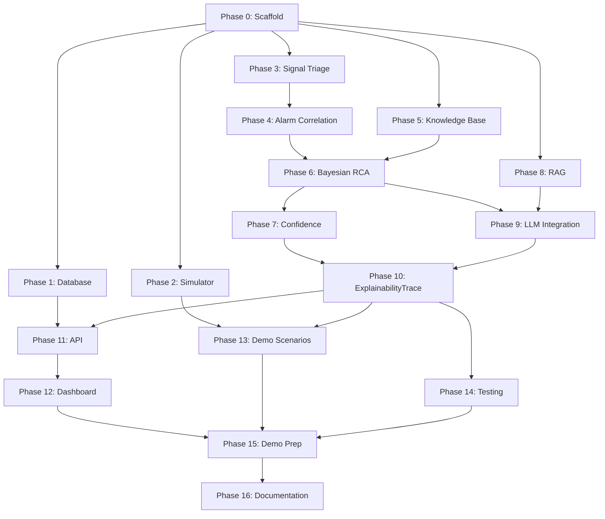

# KONE Elevate — Phase Dependency Map [PROJECT PROPOSAL]

This document defines all implementation phases, their dependencies, critical path, parallel workstreams, and milestones for the KONE Elevate RCA system prototype. All phasing, hours, and architectural dependencies presented here are classified as a [PROJECT PROPOSAL].

## Implementation Phases
The following phases (0-16) are defined in the master prompt. For each phase, define:
- Phase ID, Name, Description
- Estimated Hours
- Dependencies (which phases must complete first)
- Outputs/Deliverables
- Can Run In Parallel With

### Phase 0: Repository Scaffold & Environment [PROJECT PROPOSAL]
- **Dependencies:** None
- **Outputs:** Project structure, virtual environment, Docker Compose template, PostgreSQL container, .env.example
- **Hours:** 1-2

### Phase 1: Database Schema & Migrations [PROJECT PROPOSAL]
- **Dependencies:** Phase 0
- **Outputs:** SQLAlchemy models, Alembic migrations for all tables (elevator, telemetry, alarm_event, fault_episode, episode_alarm_link, fault_hypothesis, evidence, diagnosis, knowledge_document, maintenance_record, technician_feedback, validated_outcome, model_version, knowledge_version, drift_event, calibration_report, evaluation_run)
- **Hours:** 2-3

### Phase 2: Elevator Simulator & Fault Injection [PROTOTYPE SIMPLIFICATION]
- **Dependencies:** Phase 0
- **Can run in parallel with:** Phase 1
- **Outputs:** 5 subsystem simulators (DriveMotorSim, DoorSim, BrakeTractionSim, ControllerSafetySim, SensorEnvSim), ElevatorSimulator compositor, AlarmGenerator, 10 fault injection types, FaultGroundTruth tracking, Scenario runner
- **Hours:** 4-5

### Phase 3: Signal Triage (EWMA/CUSUM) [PROJECT PROPOSAL]
- **Dependencies:** Phase 0
- **Can run in parallel with:** Phase 1, Phase 2
- **Outputs:** SignalBaseline dataclass, update_and_score function, operating-state-aware baselines
- **Hours:** 2-3

### Phase 4: Alarm Correlation Engine [PROJECT PROPOSAL]
- **Dependencies:** Phase 3 (needs anomaly scores)
- **Outputs:** causal_links.yaml, cluster_alarms function, FaultEpisode creation with primary/consequential classification
- **Hours:** 2-3

### Phase 5: Engineering Knowledge Base [SYNTHETIC/ILLUSTRATIVE]
- **Dependencies:** Phase 0
- **Can run in parallel with:** Phases 1-4
- **Outputs:** failure_modes.yaml (6 subsystem fault trees with prior probabilities), corrective_actions.yaml, causal_links.yaml
- **Hours:** 3-4

### Phase 6: Bayesian RCA Engine [PROJECT PROPOSAL]
- **Dependencies:** Phase 4 (FaultEpisode), Phase 5 (knowledge base)
- **Outputs:** pgmpy Bayesian network built from failure_modes.yaml, VariableElimination inference, posterior calculation, evidence evaluation
- **Hours:** 3-4

### Phase 7: Confidence & Abstention Logic [PROJECT PROPOSAL]
- **Dependencies:** Phase 6 (Bayesian posteriors)
- **Outputs:** decide() function with HIGH/MEDIUM/LOW tiers, abstention triggers, dual confidence (diagnostic + action)
- **Hours:** 1-2

### Phase 8: RAG Integration [PROJECT PROPOSAL]
- **Dependencies:** Phase 0
- **Can run in parallel with:** Phases 1-7
- **Outputs:** Synthetic troubleshooting corpus in rag_corpus/ [SYNTHETIC/ILLUSTRATIVE], Chroma vector store, retrieve_evidence function, hybrid BM25+vector search
- **Hours:** 2-3

### Phase 9: LLM Integration (3 Touchpoints) [PROJECT PROPOSAL]
- **Dependencies:** Phase 6 (RCA output for arbitration), Phase 8 (RAG for evidence)
- **Outputs:** 
  1. Orchestrator extraction (LLM call #1)
  2. RCA arbitration (LLM call #2) 
  3. Synthesis rendering (LLM call #3)
- **Hours:** 3-4

### Phase 10: ExplainabilityTrace Assembly [PROJECT PROPOSAL]
- **Dependencies:** Phase 6, Phase 7, Phase 9 (all outputs needed for trace)
- **Outputs:** Full ExplainabilityTrace JSON assembly function, complete audit trail
- **Hours:** 1-2

### Phase 11: API Layer [PROJECT PROPOSAL]
- **Dependencies:** Phase 1 (database), Phase 10 (trace)
- **Outputs:** FastAPI endpoints for ingestion, episode listing, diagnosis, review, feedback
- **Hours:** 2-3

### Phase 12: Dashboard/UI [PROJECT PROPOSAL]
- **Dependencies:** Phase 11 (API)
- **Outputs:** 4-zone dashboard (Fleet, Telemetry, Investigation, Review)
- **Hours:** 3-4

### Phase 13: Demo Scenario Execution [PROJECT PROPOSAL]
- **Dependencies:** Phases 2-10 (full pipeline)
- **Outputs:** 5 scripted scenarios validated end-to-end [SYNTHETIC/ILLUSTRATIVE]
- **Hours:** 2-3

### Phase 14: Testing & Validation [PROJECT PROPOSAL]
- **Dependencies:** Phases 2-10 (testable pipeline)
- **Outputs:** pytest suite, evaluation metrics, validation gates
- **Hours:** 2-3

### Phase 15: Demo Preparation [PROJECT PROPOSAL]
- **Dependencies:** Phases 12, 13, 14
- **Outputs:** Demo script, rehearsal run, fallback plan
- **Hours:** 1-2

### Phase 16: Documentation & Handoff [PROJECT PROPOSAL]
- **Dependencies:** All phases
- **Outputs:** README, setup instructions, architecture diagrams
- **Hours:** 1-2

## Dependency Graph [PROJECT PROPOSAL]

## Critical Path [PROJECT PROPOSAL]
The longest path through the dependency graph is:
Phase 0 → Phase 3 → Phase 4 → Phase 6 → Phase 9 → Phase 10 → Phase 11 → Phase 12 → Phase 15 → Phase 16

## Parallel Workstreams [PROJECT PROPOSAL]
The following workstreams can be executed in parallel:
- **Workstream A (Core Pipeline)**: Phase 0 → Phase 3 → Phase 4 → Phase 6 → Phase 7 → Phase 10
- **Workstream B (Simulator)**: Phase 0 → Phase 2 → Phase 13
- **Workstream C (Data Layer)**: Phase 0 → Phase 1 → Phase 11
- **Workstream D (Knowledge)**: Phase 0 → Phase 5 → feeds into Phase 6
- **Workstream E (RAG)**: Phase 0 → Phase 8 → feeds into Phase 9
- **Workstream F (Frontend)**: Phase 11 → Phase 12

## Milestones [PROJECT PROPOSAL]
- **M0 (Hour 0)**: Environment ready, repo initialized
- **M1 (Hour 2)**: Schema migrated, simulator skeleton running
- **M2 (Hour 6)**: Signal triage produces anomaly scores from simulator
- **M3 (Hour 8)**: Alarm correlation clusters cascading alarms into episodes
- **M4 (Hour 12)**: Bayesian RCA ranks hypotheses for overcurrent scenario
- **M5 (Hour 14)**: Confidence/abstention logic working
- **M6 (Hour 16)**: RAG retrieves relevant documents
- **M7 (Hour 18)**: LLM arbitration and synthesis working
- **M8 (Hour 20)**: Full ExplainabilityTrace generated end-to-end
- **M9 (Hour 22)**: API endpoints serving diagnoses
- **M10 (Hour 25)**: Dashboard displaying live investigation
- **M11 (Hour 27)**: All 5 demo scenarios passing
- **M12 (Hour 29)**: Demo rehearsal complete
- **M13 (Hour 30)**: Freeze, ready for judging

## Freeze Points [PROJECT PROPOSAL]
- **Knowledge Freeze (Hour 20)**: No changes to failure_modes.yaml, causal_links.yaml, corrective_actions.yaml
- **API Freeze (Hour 25)**: No changes to API contracts
- **Code Freeze (Hour 28)**: No new features, bug fixes only
- **Demo Freeze (Hour 29)**: Rehearsed, scripted, ready
